# 风雅一号板开发套件 (Elegance-Devkit v1)


本仓库为风雅一号板提供完整的开发支持，包含示例代码、文档、固件和硬件设计文件。以下是仓库的目录结构及各部分内容说明：

```text
elegance-devkit-v1/
├── .git/                  # Git版本控制目录
├── .idea/                  # IDE配置文件目录
├── DemoCode/               # 功能演示代码
├── docs/                   # 项目文档与图片资源
├── firmware/               # 板卡固件文件（UF2格式）
├── hardware/               # 硬件设计文件（EasyEDA工程）
├── quick-tester/           # 快速测试器相关仓库
│   ├── code/               # 快速测试器代码
│   ├── docs/               # 快速测试器文档
│   ├── firmware/           # 快速测试器专用固件
│   └── hardware/           # 快速测试器相关硬件设计
├── .gitmodules             # Git子模块配置
└── README.md               # 项目说明文档
```

# MicroPython 开始，玩转树莓派 Pico 单片机/风雅一号板（MicroPython 教学开发板）产品介绍

欢迎来到[**《MicroPython 开始，玩转树莓派 Pico 单片机》**](https://f1829ryac0m.feishu.cn/wiki/Vj3fwIc1EiNI8Fkm9Vxc4QEZnKb?fromScene=spaceOverview)教程 Wiki！https://f1829ryac0m.feishu.cn/wiki/Vj3fwIc1EiNI8Fkm9Vxc4QEZnKb?fromScene=spaceOverview

这是一份**从 “零基础入门” 到 “综合实战”的树莓派 Pico 单片机教程 —— 我们用 MicroPython** 作为开发语言，帮你跳过复杂的底层编译，直接聚焦 “硬件交互 + 功能实现”，轻松上手这款轻量、灵活的单片机。

# 零、这是什么？

## 0.1 这是什么？

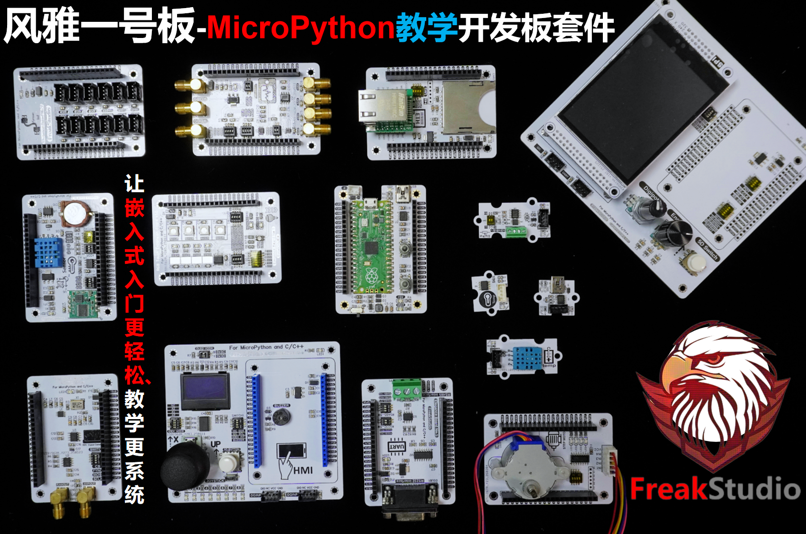

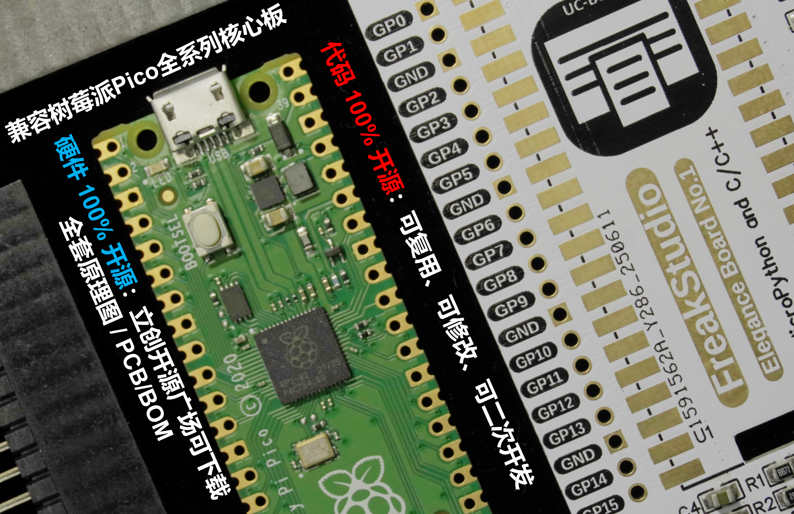

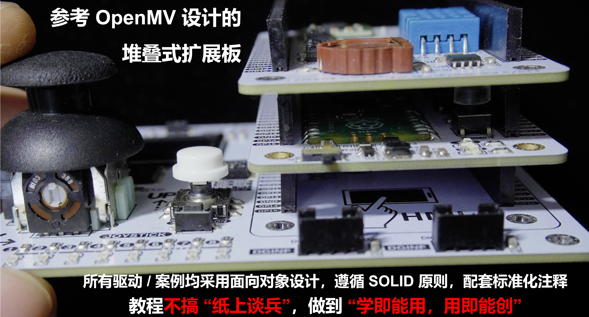

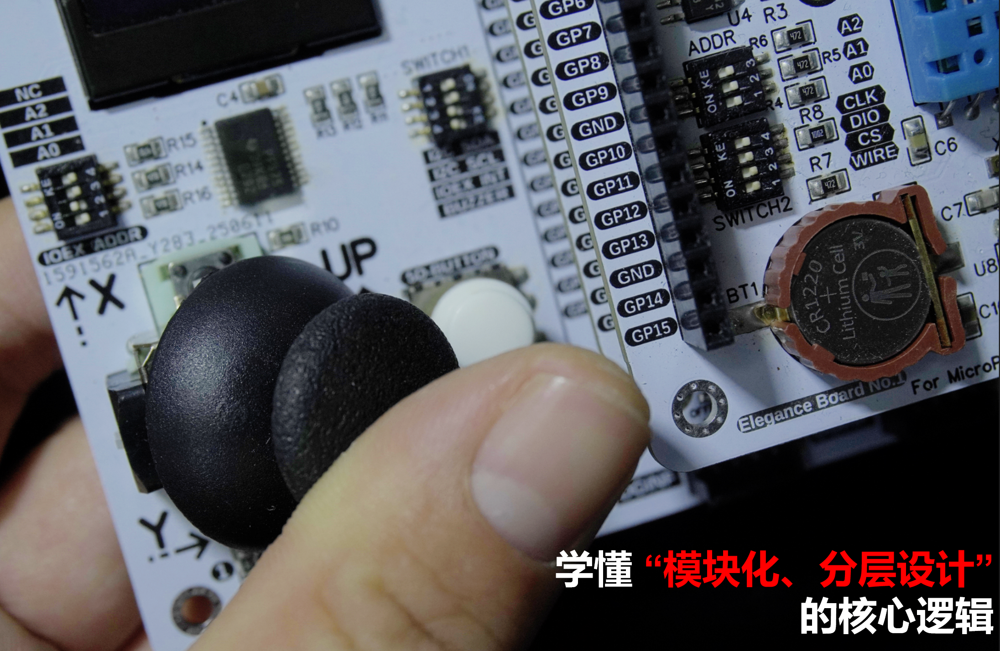

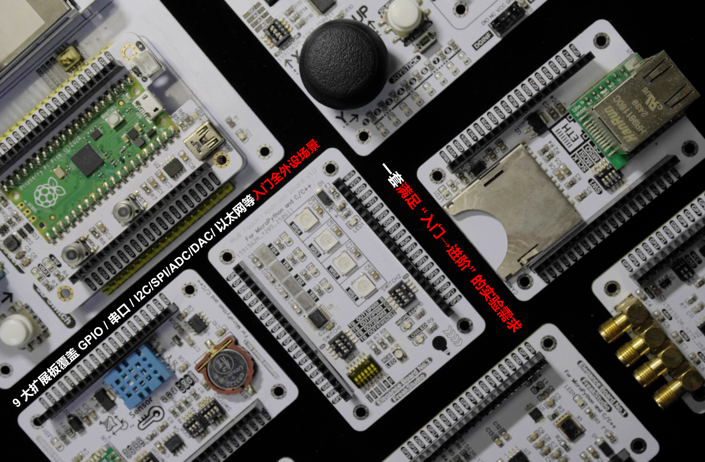

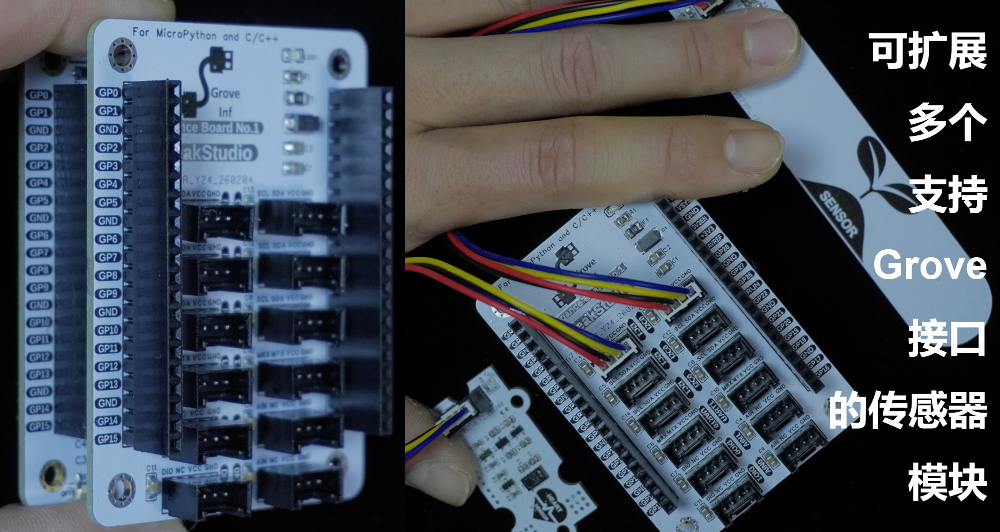

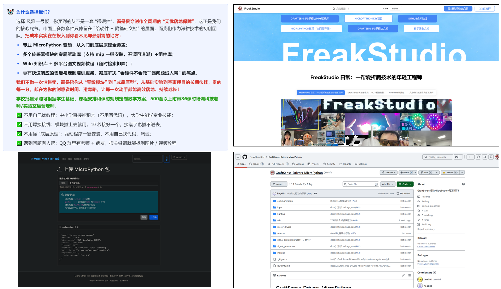

**专为 MicroPython 教学打造的堆叠式开源开发板套件，让嵌入式入门更轻松、教学更系统！！！**

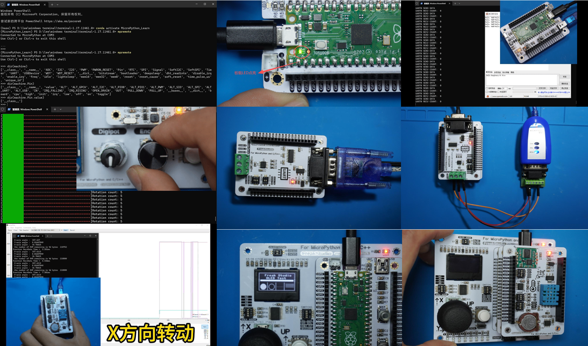

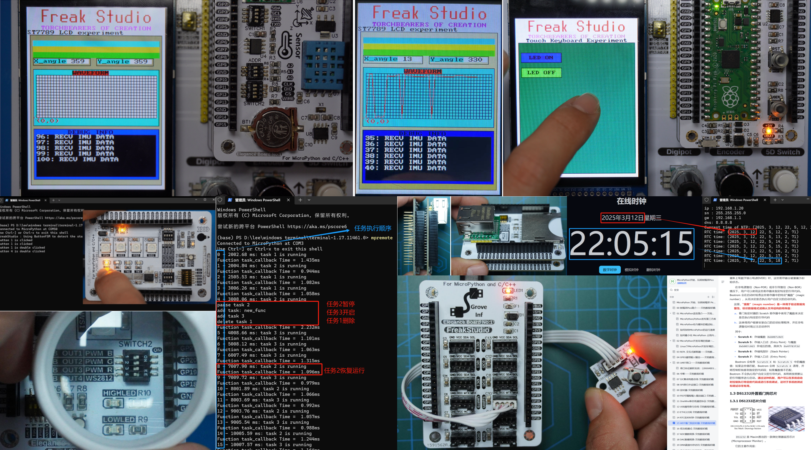

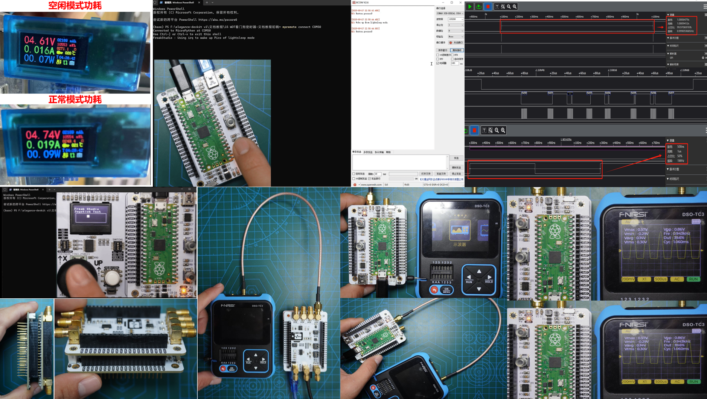

- **✨ 低门槛上手：告别嵌入式 “劝退式” 学习：**摒弃传统嵌入式开发 “编译慢、配环境、啃寄存器” 的痛点，依托 MicroPython 免编译特性，代码修改即时生效、REPL 交互式调试实时反馈，**零基础也能 10 分钟点亮 LED、读取传感器数据**，从 “写代码” 到 “看到效果” 无延迟，快速获得成就感，再也不用为底层配置耗半天。
- 🛠️ **全场景实战：硬件 + 内容精准适配教学**

  - **硬件端**：参考 OpenMV 设计的堆叠式扩展板，10 大扩展板覆盖 GPIO / 串口 / I2C/SPI/ADC/DAC/ 以太网等全外设场景，兼容树莓派 Pico 全系列核心板，一套满足 “入门 → 进阶” 所有实验需求；
  - **内容端**：教程不搞 “纸上谈兵”，每个知识点都对应 “硬件实操 + 代码案例 + 项目落地”，从按键交互、温湿度采集到波形发生器、MQTT 物联网节点，学一个会一个，做一个成一个。
- **🎯 标准代码：从入门就接轨标准开发**

  - 代码层面：所有驱动 / 案例均采用**面向对象设计**，遵循 SOLID 原则，配套标准化注释 —— 不仅能跑通，更能学懂 “模块化、分层设计” 的核心逻辑；
  - 硬件层面：全开源设计文件适配手工焊接（核心阻容 0805 封装），从 “用硬件” 到 “做硬件”，培养完整的电子工程思维。
- **🔧 开源可拓展：把 “学习工具” 变成 “创作平台”**

  - 代码 100% 开源：可复用、可修改、可二次开发，支持发布自有库到专属 uPyPI 平台，打造个人嵌入式工具链；
  - 硬件 100% 开源：立创开源广场可下载全套原理图 / PCB/BOM，新手能复刻、老手能 DIY，从 “学现成” 到 “造专属”，折腾无上限。
- **📈 闭环式学习：从 “懂知识点” 到 “做成品”**

  - 构建 “原理拆解 → 代码实践 → 原型制作 → 迭代优化” 的完整学习闭环：
  - 基础阶段：学透 MicroPython 语法、硬件外设原理；
  - 进阶阶段：用快速原型扩展板做物联网监测、互动装置等实战项目；
  - 拔高阶段：通过开源代码 / 硬件改造，把作品升级为可演示的产品级原型，真正做到 “学即能用，用即能创”。
- **🎨 分层式教学：适配不同人群的学习路径**

  - 零基础 / 青少年：Bipes 图形化编程拖拽积木控硬件，零代码基础也能做互动发明，还能通过 “图形 → 代码” 对照，轻松过渡到专业开发；
  - 高校学生 / 开发者：配套《面向对象编程》《并行计算》进阶教程，结合嵌入式场景练工程化思维，快速落地课程项目 / 产品原型；
  - MicroPython 爱好者：补充底层原理 + 性能优化技巧，从 “会用” 到 “精通”，补足嵌入式核心能力短板。
- **🚀 专属生态支撑：告别 “找资源、踩坑多”**

  - 自研 uPyPI 包管理平台 + 100 + 传感器配套 Wiki / 图文 / 视频教程，驱动库一键安装、资料即查即用，还有专属社群答疑 —— 不用全网搜零散教程，一套资源搞定 MicroPython 嵌入式开发全链路。

## 0.2 面向对象


## 0.3 为什么选择 MicroPython + 风雅一号板

### 0.3.1 为什么是 MicroPython（mpy）

**传统嵌入式开发易放弃的原因：**

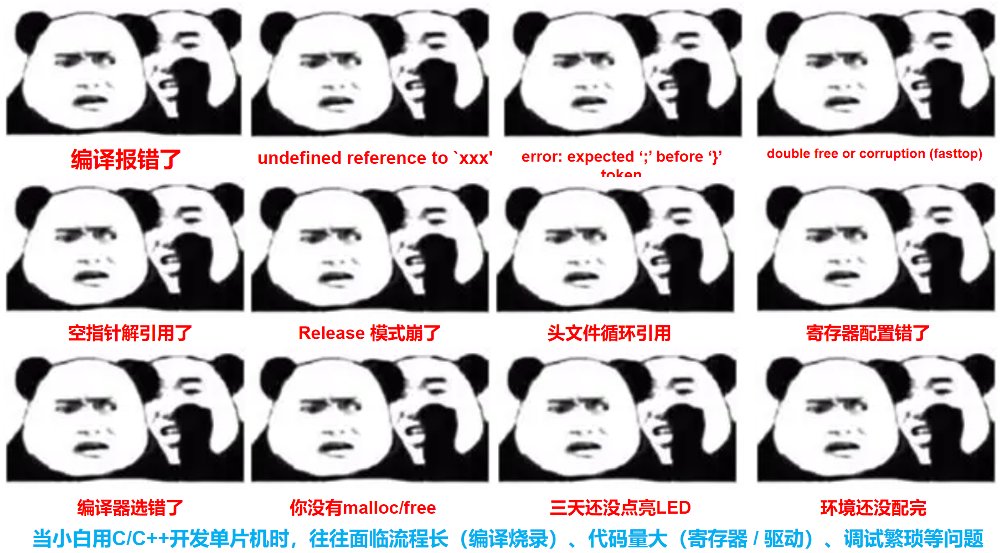

- MicroPython 的优势：
  1. 不用编译：代码直接运行，修改即时生效。
  2. 实时调试：终端能直接看传感器数据、测试命令，不用反复烧录。
  3. 操作简单：不用管底层寄存器，调用现成功能就能控硬件。

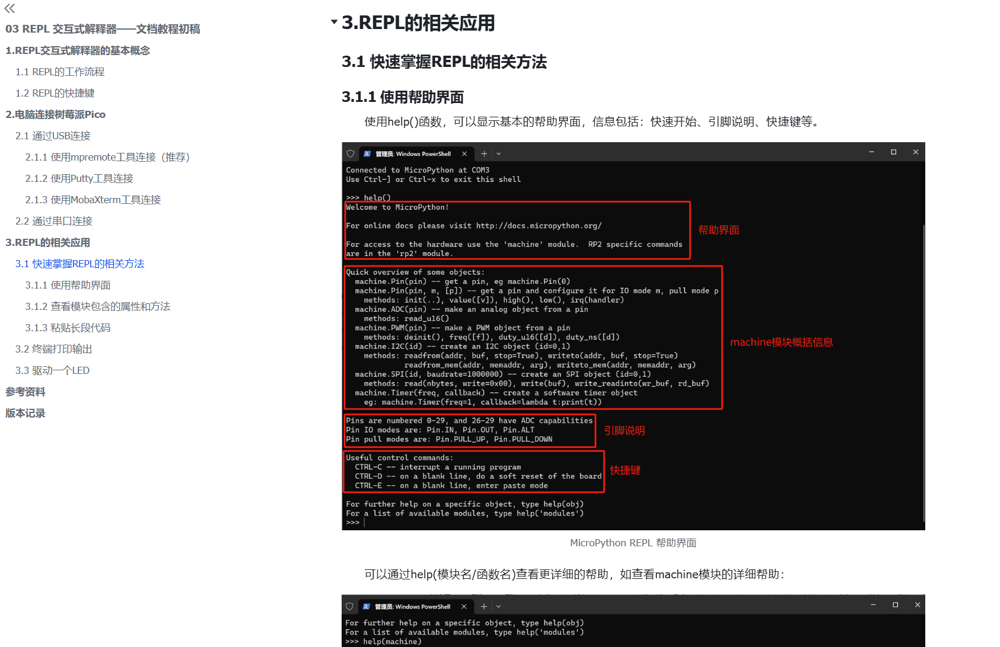

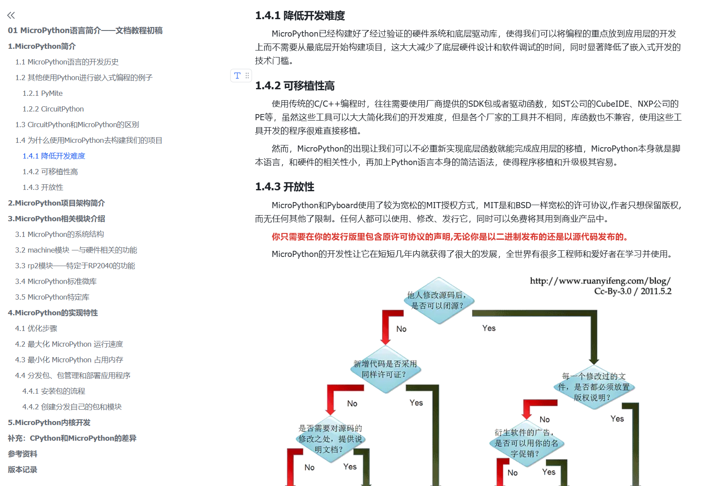

- **速度担心无需有：**
  1. **大部分模块够用：传感器通信速度有限，MPY 能跟上。**
  2. **高速需求有解法：用 PIO 或 DMA 技术提升性能。**
  3. **可优化：代码编译成.mpy 文件，速度接近 C 语言。**

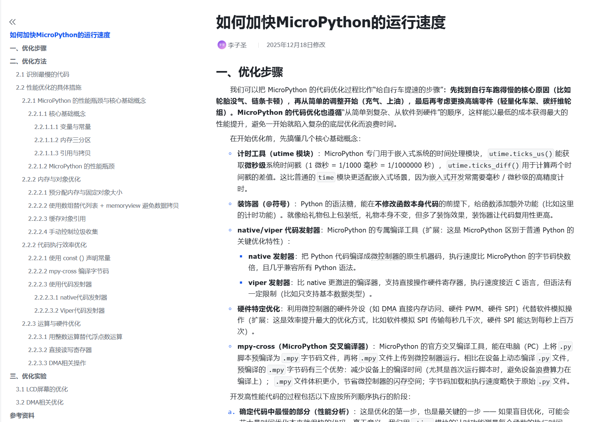

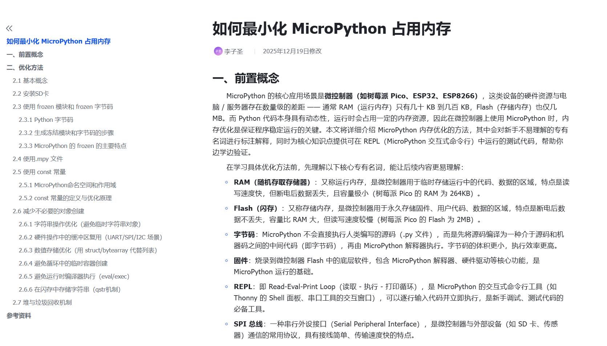

- 入门不影响工作：

  1. 快速理解核心逻辑：搭建硬件与软件交互框架，保持学习兴趣。
  2. 匹配工作重心：实际工作多做业务逻辑，而非底层驱动。
  3. 理解开发框架：学会模块化、分层设计，适配工作需求。
- 想学底层也能学：配套教程结合芯片手册，讲解底层原理和驱动编写。

### 0.3.2 为什么是风雅一号板/选择我们

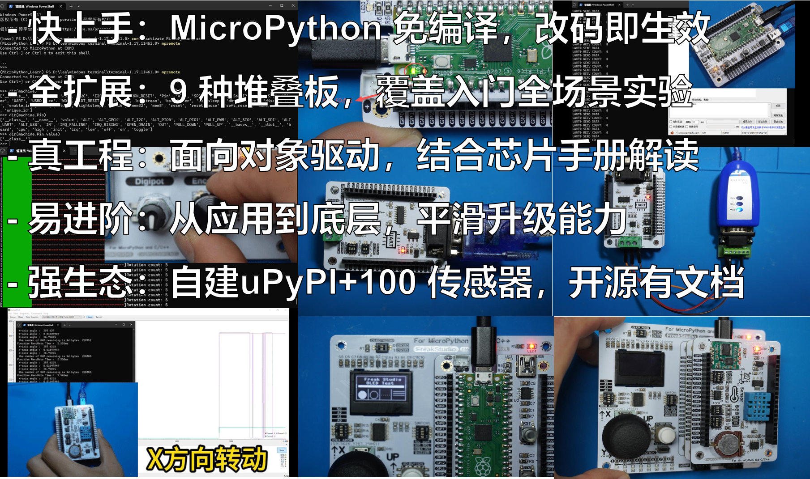


# 一、风雅一号板介绍与发货配件

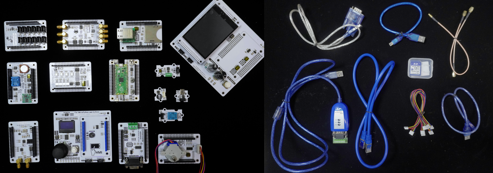

发货清单包括以下内容：

| **名称**                                  | **规格/配件**                                                                                                                | **数量** |
| ----------------------------------------- | ---------------------------------------------------------------------------------------------------------------------------- | -------- |
| 通用兼容扩展板                            | 板载树莓派 Pico 核心板，板载 CH340K USB 转 TTL 芯片、复位按键和用户按键。                                                    | x1       |
| 七彩触控扩展板                            | 板载一个 TTP224、四个 WS2812、一个 RGB LED 和一对高低电平触发 LED。                                                          | x1       |
| 环境与存储扩展板                          | 板载串口陀螺仪、DHT11、DS1302 RTC 芯片和 AT24C256。                                                                          | x1       |
| OLED 显示与交互扩展板                     | 板载 0.96 寸 OLED 屏幕、16 位 IO 扩展芯片、五向按键、独立 SET 按键、模拟摇杆、无源蜂鸣器、8 个 LED 灯和两个 Grove 数字接口。 | x1       |
| LCD 屏幕人机交互扩展板                    | 板载 3.2 寸 LCD 触摸屏、旋转电位器、五向按键、旋转编码器和 1 个 UART 和 1 个 I2C Grove 接口。                                | x1       |
| 串口电平转换板                            | 板载一个 MAX13487 芯片和一个 MAX3232 芯片。                                                                                  | x1       |
| 数据转换板                                | 无板载一个 ADS1115 和一个 MCP4725 以及两个内部 ADC 输入 SMA 接口。                                                           | x1       |
| 可调 DDS 信号发生板                       | 板载 AD9833 和 MCP41010 芯片，两个 SMA 接口。                                                                                | x1       |
| Grove 接口扩展板                          | 板上集成了多个符合 Grove 规范的 HY2.0-4P 接口。                                                                              | x1       |
| 以太网与 SD 卡扩展板                      | 板载 W5500 模块和 SD 卡。                                                                                                    | x1       |
| GraftSense-基于 CH340K 的 USB 转 TTL 模块 | HY2.0-4P-反向排线 x 1 MiniUSB 连接线 x 1                                                                                     | x1       |
| GraftSense-基于 DS18B20 的温度传感器模块  | HY2.0-4P-反向排线 x 1                                                                                                        | x1       |
| GraftSense-基于 DS1232 芯片的看门狗模块   | HY2.0-4P-反向排线 x 1                                                                                                        | x1       |
| GraftSense-基于 DS3502 的数字电位器模块   | HY2.0-4P-反向排线 x 1  MCX 公转红黑杜邦线 x 1                                                                                | x1       |
| GraftSense-基于 LM2596S 的可调电源模块    | 锂电池充电器套装 x 1                                                                                                         | x1       |
| USB 转 MicroUSB 连接线                    | 0.5m                                                                                                                         | x1       |
| MiniUSB 连接线 x 1                        | 0.25m                                                                                                                        | x1       |
| 网线                                      | 1m 六类千兆                                                                                                                  | x1       |
| RS232 转 USB 连接器                       | 0.5m                                                                                                                         | x1       |
| RS485 转 USB 连接器                       | 工业级 USB 转 485                                                                                                            | x1       |
| 逻辑分析仪                                | NanoDLA                                                                                                                      | x1       |
| SMA 公转 SMA 公线                         |                                                                                                                              | x1       |
| SMA 转红黑杜邦线                          |                                                                                                                              | x1       |
| SMA 转 MCX 线                             |                                                                                                                              | x1       |
| 聚合物锂电池                              |                                                                                                                              | x1       |
| SD 卡                                     | 工业级                                                                                                                       | x1       |

## 1.1 通用兼容扩展板

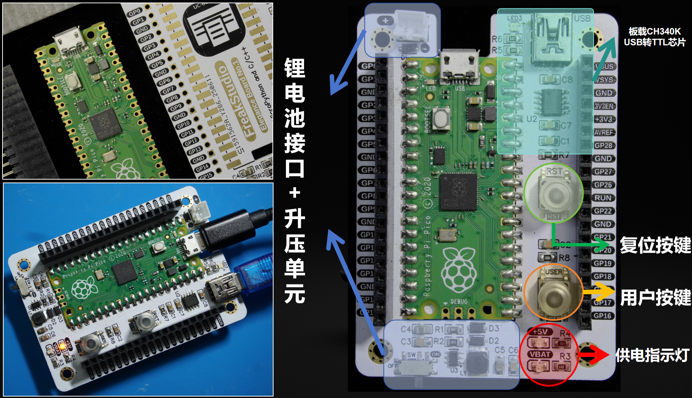

这是一个灵活的开发适配平台，它通过板上焊盘兼容焊接树莓派 Pico 系列多种微控制器核心板，让用户可按需灵活选择主控；同时集成板载 CH340K USB 转 TTL 芯片、复位按键和用户按键，提供程序烧录、串口调试与自定义功能，以 “一个平台，多种核心” 为设计思想，将固定硬件转变为可定制的开发系统，开箱即用，可作为各类项目的基础来承载核心板并连接电脑编程调试。

| **树莓派 Pico 引脚编号** | **对应 MCU 外设** | **扩展板对应设备**     |
| ------------------------ | ----------------- | ---------------------- |
| GP0                      | UART0-TX          | USB 转 TTL 芯片-RXD    |
| GP1                      | UART0-RX          | USB 转 TTL 芯片-TXD    |
| RUN                      | 数字 IO           | RST 按键-数字信号输出  |
| GP22                     | 数字 IO           | USER 按键-数字信号输出 |

## 1.2 七彩触控扩展板

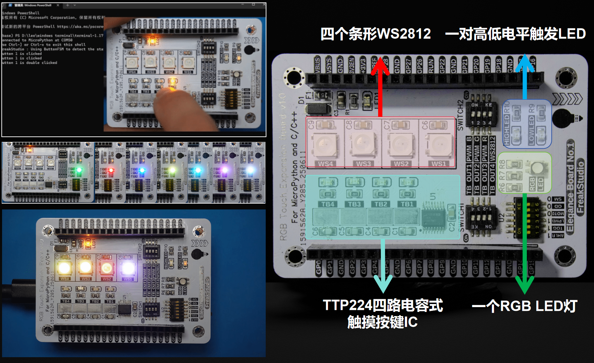

- **核心功能：**提供现代化的触摸交互和炫目的 RGB 光效。
- **组件详情：**

  - TTP224：四路电容式触摸按键 IC。
  - WS2812：四个环形 LED 条带，每个 LED 可独立编程控制颜色和亮度。
  - RGB LED：一个全彩 LED 灯。
  - 高低电平触发 LED：基础状态指示灯。
- **设计思想：**将炫酷的光效与触摸控制结合，打造吸引人的交互体验。

| **树莓派 Pico 引脚编号** | **对应 MCU 外设** | **扩展板对应设备**    |
| ------------------------ | ----------------- | --------------------- |
| GP10                     | 数字 IO           | 一号触摸按键-数字输出 |
| GP11                     | 数字 IO           | 二号触摸按键-数字输出 |
| GP12                     | 数字 IO           | 三号触摸按键-数字输出 |
| GP13                     | 数字 IO           | 四号触摸按键-数字输出 |
| GP21                     | PWM 定时器        | RGB LED 灯-BLUE 端    |
| GP20                     | PWM 定时器        | RGB LED 灯-GREEN 端   |
| GP19                     | PWM 定时器        | RGB LED 灯-RED 端     |
| GP18                     | 数字 IO           | WS2812-信号输入端     |
| GP17                     | 数字 IO           | 共阳级 LED-高电平     |
| GP16                     | 数字 IO           | 共阴级 LED-高电平     |

## 1.3 环境与存储采集板

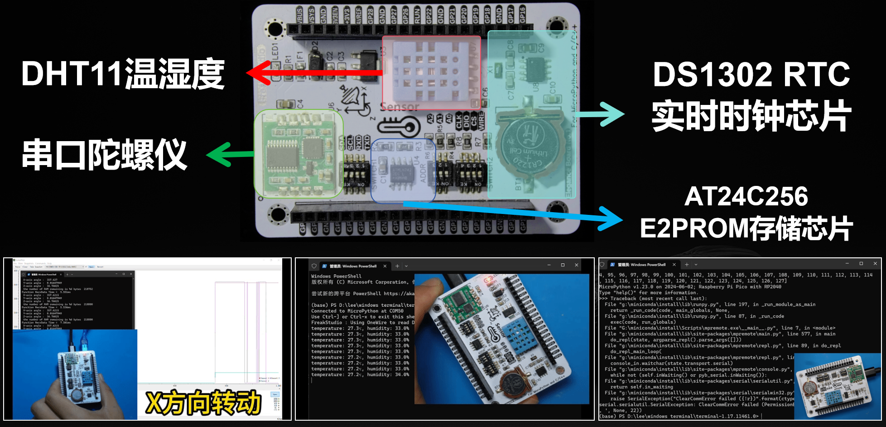

- **核心功能：**集成多种常用传感器和存储模块，用于数据采集与记录。
- **组件详情：**

  - 串口陀螺仪：通过 UART 输出，测量角速度，感知物体姿态。
  - DHT11：采集环境温湿度数据。
  - DS1302 RTC：提供精确的实时时钟，带备用电池，断电不停走。
  - AT24C256：I2C 接口的 EEPROM 存储芯片(256Kbit)，用于存储系统配置或采集到的数据。
- **设计思想：**一站式解决对环境参数、运动状态、时间的监测以及数据非易失性存储的需求。
- **典型应用：**环境监测站、数据记录器(Data Logger)、时间触发的自动化设备。

| **树莓派 Pico 引脚编号** | **对应 MCU 外设** | **扩展板对应设备**           |
| ------------------------ | ----------------- | ---------------------------- |
| GP2                      | I2C1-SDA          | EEPROM 芯片 AT24C256-I2C-SDA |
| GP3                      | I2C1-SCL          | EEPROM 芯片 AT24C256-I2C-SCL |
| GP4                      | UART1-TX          | 串口陀螺仪-UART-RX           |
| GP5                      | UART1-RX          | 串口陀螺仪-UART-TX           |
| GP10                     | 数字 IO           | RTC 实时时钟芯片 DS1302-CLK  |
| GP11                     | 数字 IO           | RTC 实时时钟芯片 DS1302-DIO  |
| GP12                     | 数字 IO           | RTC 实时时钟芯片 DS1302-CS   |
| GP13                     | 数字 IO           | DHT11 温湿度芯片-单总线      |

## 1.4 OLED 显示与交互扩展板

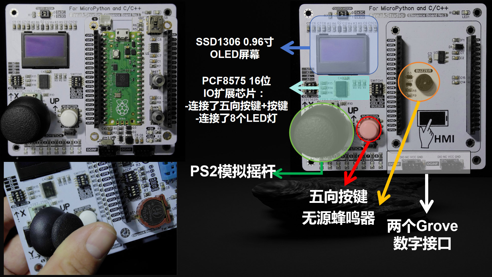

- **核心功能：**在紧凑尺寸内提供显示和多样交互功能。
- **组件详情：**

  - **OLED 屏幕：**高对比度的单色显示屏，适合显示文本、图标和数据。
  - **IO 扩展芯片：**扩展主控 IO，用于管理板载的多组件。
  - **输入设备：**五向按键、独立 SET 按键、模拟摇杆。
  - **输出设备：**无源蜂鸣器（发声）、8 个 LED 灯（状态指示）。
  - **扩展接口：**两个 Grove 数字接口。
- **设计思想：**IO 扩展芯片优化了主控引脚资源。

| **树莓派 Pico 引脚编号** | **对应 MCU 外设** | **扩展板对应设备**            |
| ------------------------ | ----------------- | ----------------------------- |
| GP6                      | I2C1-SDA          | OLED 屏幕/IO 扩展芯片-I2C-SDA |
| GP7                      | I2C1-SCL          | OLED 屏幕/IO 扩展芯片-I2C-SCL |
| GP8                      | 数字 IO           | IO 扩展芯片-中断引脚          |
| GP9                      | PWM 定时器        | 蜂鸣器-PWM 信号输入           |
| GP27                     | ADC1              | 摇杆 X 方向-模拟电压输出      |
| GP26                     | ADC0              | 摇杆 Y 方向-模拟电压输出      |
| GP22                     | 数字 IO           | 摇杆开关数字信号输出          |

## 1.5 LCD 屏幕人机交互板

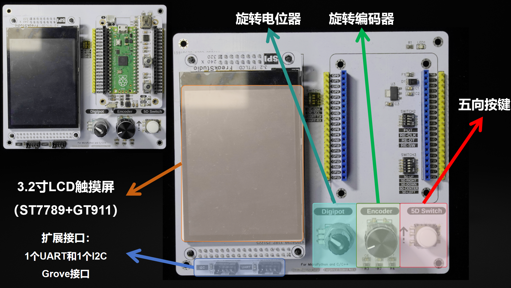

- **核心功能：**提供一套完整的图形化人机交互解决方案。
- **组件详情：**

  - **LCD 触摸屏：**提供彩色图形显示和触控输入功能。
  - **旋转电位器：**用于模拟值调节（如音量、亮度对比度）。
  - **五向按键：**提供上、下、左、右、确认五种操作。
  - **旋转编码器：**提供精确的数字旋转输入，通常带按下功能。
  - **扩展接口：**1 个 UART 和 1 个 I2C Grove 接口，用于连接其他串行设备。
- **设计思想：**将常用的交互硬件高度集成，方便开发者快速为项目添加复杂的用户界面和控制功能。
- **典型应用：**设备控制面板、仪器仪表界面、嵌入式系统菜单导航、DIY 游戏机。

| **树莓派 Pico 引脚编号** | **对应 MCU 外设** | **扩展板对应设备**       |
| ------------------------ | ----------------- | ------------------------ |
| GP2                      | I2C1-SDA          | Grove 接口-I2C-SDA       |
| GP3                      | I2C1-SCL          | Grove 接口-I2C-SCL       |
| GP4                      | UART1-TX          | Grove 接口-UART-TX       |
| GP5                      | UART1-RX          | Grove 接口-UART-RX       |
| GP6                      | SPI0-SCK          | LCD 屏幕-SCK             |
| GP7                      | SPI0-MOSI         | LCD 屏幕-MOSI            |
| GP8                      | 数字 IO           | LCD 屏幕-RST             |
| GP9                      | 数字 IO           | LCD 屏幕-DC              |
| GP10                     | 数字 IO           | LCD 屏幕-CS              |
| GP11                     | 数字 IO           | LCD 屏幕-BLK             |
| GP12                     | I2C0-SDA          | LCD 屏幕触摸芯片-I2C-SDA |
| GP13                     | I2C0-SCL          | LCD 屏幕触摸芯片-I2C-SCL |
| GP14                     | 数字 IO           | LCD 屏幕触摸芯片-CS      |
| GP15                     | 数字 IO           | LCD 屏幕触摸芯片-INT     |
| GP28                     | ADC2              | 旋转电位器-POT 电压输出  |
| GP27                     | 数字 IO           | 数字电位器-CLK           |
| GP26                     | 数字 IO           | 数字电位器-DT            |
| GP21                     | 数字 IO           | 数字电位器-SW            |
| GP20                     | 数字 IO           | 五向按键-UP              |
| GP19                     | 数字 IO           | 五向按键-RIGHT           |
| GP18                     | 数字 IO           | 五向按键-DOWN            |
| GP17                     | 数字 IO           | 五向按键-CENTER          |
| GP16                     | 数字 IO           | 五向按键-LEFT            |

## 1.6 串口电平转换板

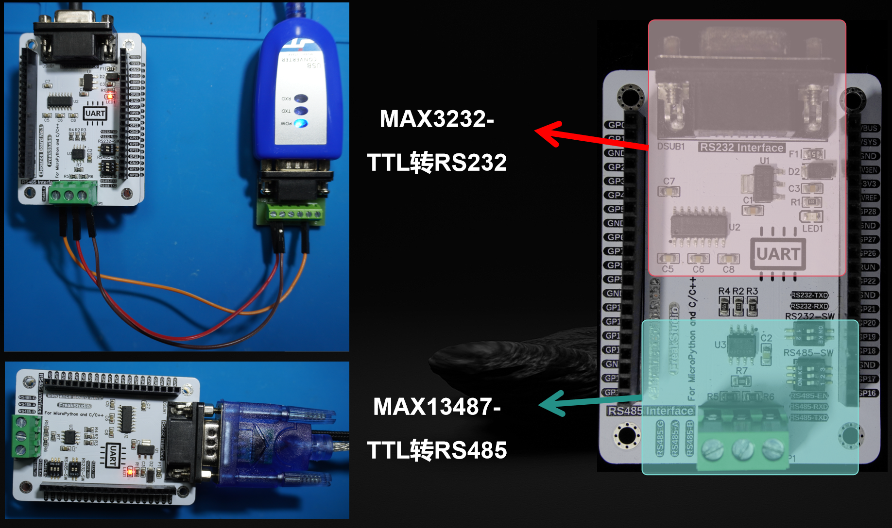

- **核心功能：**把主板的 TTL 串口转换为 RS-485、RS-232 等工业/仪器标准，方便连接外部设备。
- **芯片详情：**

  - MAX13487：RS-485 收发器，支持半双工通信，抗干扰能力强，适用于长距离工业网络。
  - MAX3232：RS-232 收发器，用于连接 PC、调制解调器等使用 ±12V 电平的传统设备。
- **设计思想：**解决嵌入式系统与外部工业设备或老式计算机之间的通信兼容性问题。

| **树莓派 Pico 引脚编号** | **对应 MCU 外设** | **扩展板对应设备**            |
| ------------------------ | ----------------- | ----------------------------- |
| GP18                     | 数字 IO           | MAX13487 芯片-EN              |
| GP17                     | UART0-RX          | MAX13487 芯片/MAX3232 芯片-TX |
| GP16                     | UART0-TX          | MAX13487 芯片/MAX3232 芯片-RX |

## 1.7 数据转换板

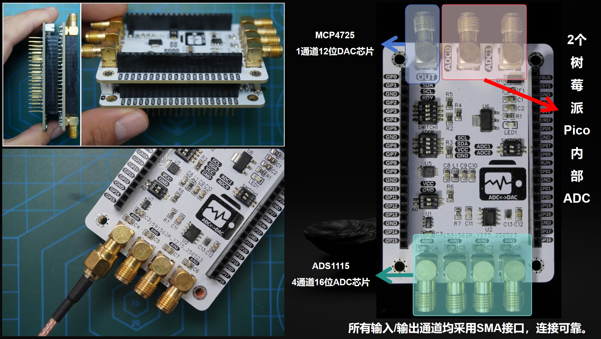

- **核心功能：**提供高精度的模拟信号与数字信号之间的转换。
- **芯片详情：**

  - ADS1115：16 位高精度 ADC（4 通道），用于将模拟信号（如传感器电压）转换为数字值。
  - MCP4725：12 位 DAC，用于将数字值转换为精确的模拟电压输出。
  - 接口：所有输入/输出通道均采用 SMA 接口，连接可靠，适用于高频或需要屏蔽干扰的信号。

| **树莓派 Pico 引脚编号** | **对应 MCU 外设** | **扩展板对应设备**                |
| ------------------------ | ----------------- | --------------------------------- |
| GP2                      | I2C1-SDA          | ADS1115 芯片/MCP4725 芯片-I2C-SDA |
| GP3                      | I2C1-SCL          | ADS1115 芯片/MCP4725 芯片-I2C-SCL |
| GP4                      | 数字 IO           | ADS1115 芯片-RDY                  |
| GP27                     | ADC1              | SMA 接口                          |
| GP26                     | ADC0              | SMA 接口                          |

## 1.8 可调 DDS 信号发生板

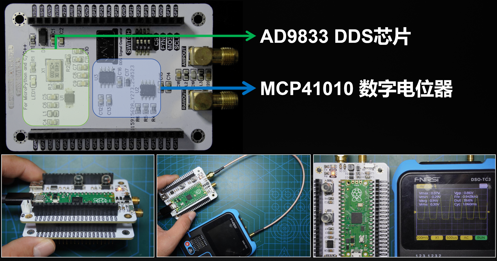

- **核心功能：**生成可编程波形（正弦/方/三角），频率、幅度可调，适合教学信号发生与小型测试。
- **芯片详情：**

  - AD9833：直接数字频率合成芯片，可产生正弦波、三角波和方波，频率可通过编程精确控制。
  - MCP41010：数字电位器，用于编程调节输出信号的幅度。

| **树莓派 Pico 引脚编号** | **对应 MCU 外设** | **扩展板对应设备**                   |
| ------------------------ | ----------------- | ------------------------------------ |
| GP21                     | 数字 IO           | MCP41010 数字电位器-CS               |
| GP20                     | 数字 IO           | AD9833 芯片-FSYNC                    |
| GP19                     | SPI0-TX           | AD9833 芯片/MCP41010 数字电位器-MOSI |
| GP18                     | SPI0-SCK          | AD9833 芯片/MCP41010 数字电位器-SCLK |

## 1.9 Grove 接口扩展板

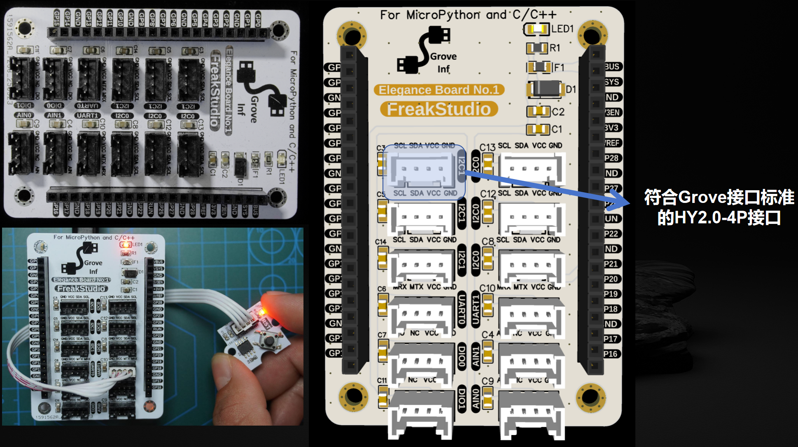

- **核心功能：**提供与 Grove 生态系统无缝对接的能力。板上集成了多个符合 Grove 规范的 HY2.0-4P 接口（通常包含 I2C、数字、模拟接口类型）。

| **树莓派 Pico 引脚编号** | **对应 MCU 外设** | **扩展板对应设备**        |
| ------------------------ | ----------------- | ------------------------- |
| GP4                      | UART1-TX          | Grove-UART1 接口-UART1-TX |
| GP5                      | UART1-RX          | Grove-UART1 接口-UART1-RX |
| GP10                     | 12C1-SDA          | Grove-12C1 接口-12C1-SDA  |
| GP11                     | I2C1-SCL          | Grove-12C1 接口-I2C1-SCL  |
| GP12                     | UART0-TX          | UART0-TXGrove-UART0 接口- |
| GP13                     | UART0-RX          | Grove-UART0 接口-UART0-RX |
| GP14                     | 数字 IO           | Grove-DIO0 接口-DIO       |
| GP15                     | 数字 IO           | Grove-DIO1 接口-DIO       |
| GP27                     | ADC1              | Grove-AIN1 接口-AIN       |
| GP26                     | ADC0              | Grove-AIN0 接口-AIN       |
| GP21                     | I2C0-SCL          | Grove-12C0 接口-I2C0-SCL  |
| GP20                     | I2C0-SDA          | Grove-12C0 接口-I2C0-SDA  |

## 1.10 以太网与 SD 卡扩展板

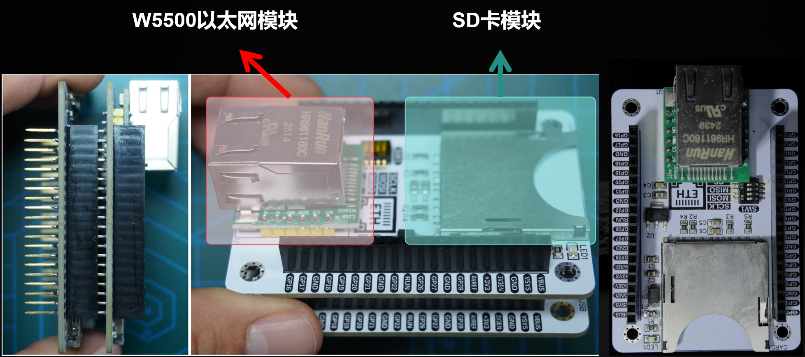

- **核心功能：**为设备提供以太网网络接口（TCP/UDP/HTTP）与本地 SD 卡存储，适合远程监控与数据记录。
- **组件详情：**

  - W5500：硬协议以太网控制器，内置 TCP/IP 协议栈，减轻主控负担，提供稳定可靠的网络性能。
  - SD 卡模块：通过 SPI 接口读写 SD/TF 卡，用于存储大量数据（如图片、日志、音频文件）。
- **设计思想：**让嵌入式设备轻松接入局域网/互联网，并具备海量数据存储能力，是物联网项目的关键模块。
- **典型应用：**网络服务器、物联网网关、远程监控系统、数据记录仪

| **树莓派 Pico 引脚编号** | **对应 MCU 外设** | **扩展板对应设备**         |
| ------------------------ | ----------------- | -------------------------- |
| GP10                     | SPI1-SCK          | SD 卡-SCLK                 |
| GP11                     | SPI1-TX           | SD 卡-MOSI                 |
| GP12                     | SPI1-RX           | SD 卡-MISO                 |
| GP13                     | SPI1-CSn          | SD 卡-CS                   |
| GP21                     | 数字 IO           | 外部以太网 W5500 芯片-INT  |
| GP20                     | 数字 IO           | 外部以太网 W5500 芯片-RST  |
| GP19                     | SPI0-TX           | 外部以太网 W5500 芯片-MOSI |
| GP18                     | SPI0-SCK          | 外部以太网 W5500 芯片-SCLK |
| GP17                     | SPI0-CSn          | 外部以太网 W5500 芯片-CS   |
| GP16                     | SPI0-RX           | 外部以太网 W5500 芯片-MISO |


# 二、能学到什么？

- 基础能力层：

  - 嵌入式入门：认识 Pico/RP2040 开发板硬件、看懂基础电路原理、掌握 MicroPython 入门语法、搭建专属开发环境
  - 编程核心能力：理解面向对象编程思路、学会模块化代码设计（让代码更易读、易维护）
- 硬件实战层：

  - 外设全掌握：学会 GPIO、UART、I2C、SPI、定时器、PIO、ADC/DAC 等 18 + 外设的驱动开发（懂原理、能实操）
  - 通信协议精通：搞懂 UART、I2C、SPI、OneWire、USB、以太网等协议原理，动手实现设备间数据传输
  - 进阶技术突破：掌握 DMA、低功耗模式、看门狗、文件系统与存储等实用技术
  - 组件与并发开发：会用 lvgl 图形化界面、ulab 科学计算、upy-shell、ulogger 日志、modbus 协议等第三方组件库；学会多线程 / 协程开发（让程序同时处理多个任务）
- 项目工程层：

  - 系统思维：学会分层设计、驱动架构搭建，用模块化方式开发完整项目
  - 实战项目：从传感器数据采集，到波形发生、MQTT/HTTP 网络通信等完整实战项目开发
  - 底层深入：结合芯片手册理解寄存器原理，动手编写 PIO 汇编等底层驱动
- 开源生态贡献：

  - 学会第三方库发布流程、uPyPI 包管理方法

## 2.1 树莓派 Pico & RP2040 核心信息概要


## 2.2 MicroPython 语言简述


## 2.3 MicroPython 开发环境搭建


## 2.4 REPL 交互式解释器的使用


## 2.5 单片机外设的基本原理和树莓派 Pico 对应寄存器介绍


## 2.6 MicroPython 控制对应外设的相关方法和相关工具软件使用


## 2.7 相关应用实验


## 2.8 通信协议和组件库部分


### 2.8.1 以太网通信协议


### 2.8.2 ulab 科学计算


### 2.8.3 文件系统与相关操作


### 2.8.4 图形化 GUI


### 2.8.5 uShell 命令行


### 2.8.6 uMial 邮件发送 SMTP


# 三、有什么教学资料？

这里是**从入门到进阶、从理论到落地的一站式嵌入式教学资源库**，让你学有路径、做有工具、创有支撑：

## 3.1 MicroPython 教学知识库

相关链接：[MicroPython 开始，玩转树莓派 Pico 单片机/风雅一号板（MicroPython 教学开发板）产品介绍](https://f1829ryac0m.feishu.cn/wiki/Vj3fwIc1EiNI8Fkm9Vxc4QEZnKb?from=from_copylink)

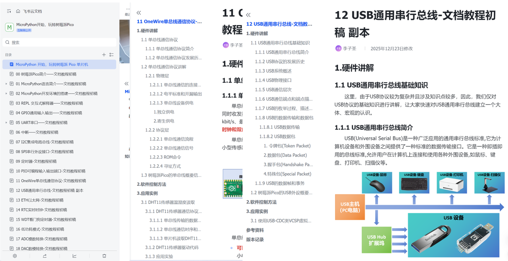

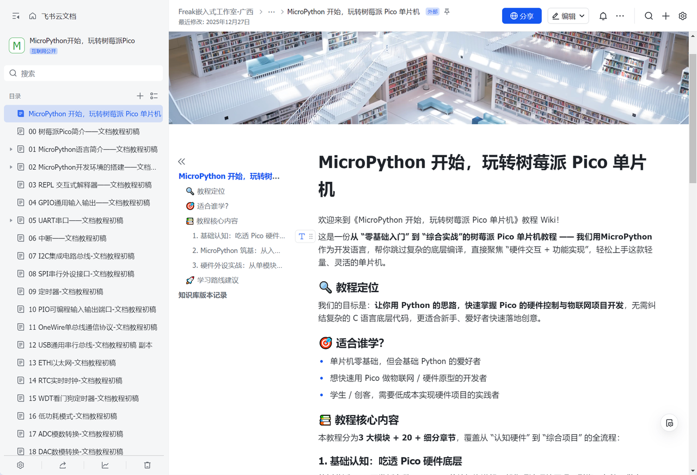

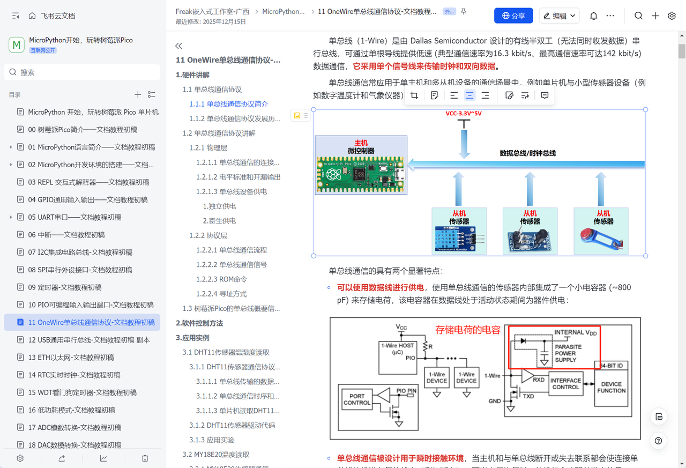

## 3.2 可扩展电子模块快速使用和硬件原理

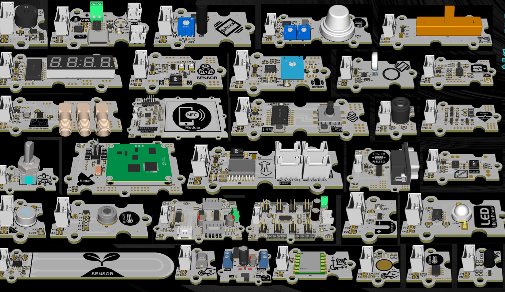

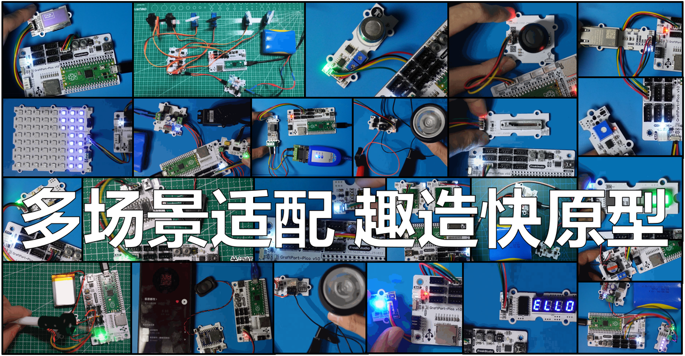

相关链接：[GraftSense 传感器模块文档（开放版）](https://f1829ryac0m.feishu.cn/wiki/AYm7wpo8ciMapfkzzzNcGoHjn7d?from=from_copylink)

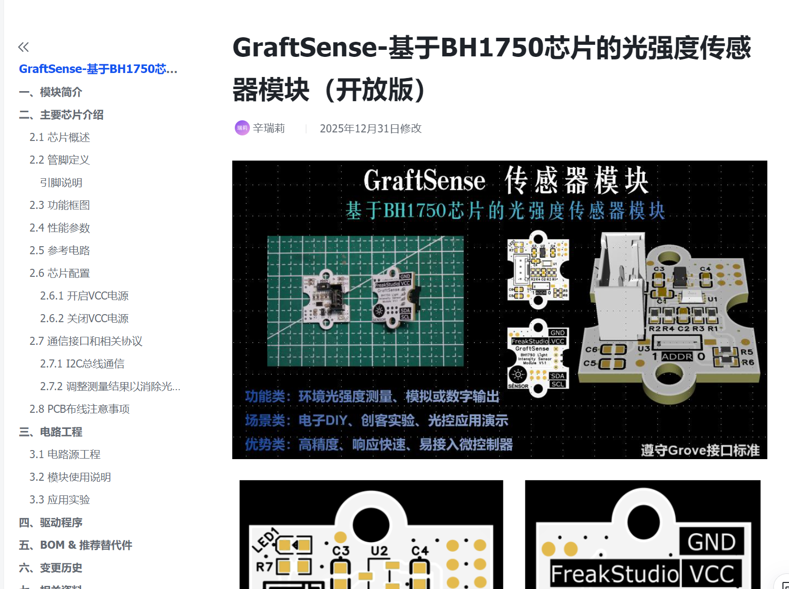

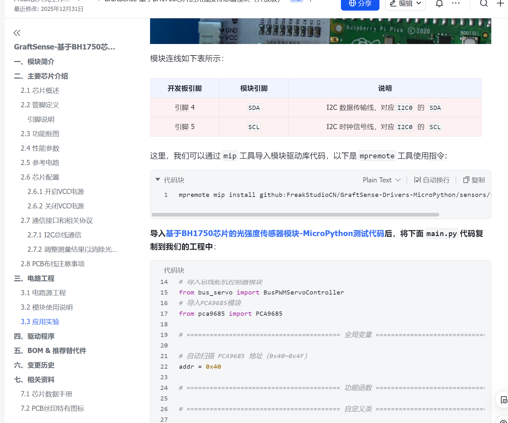

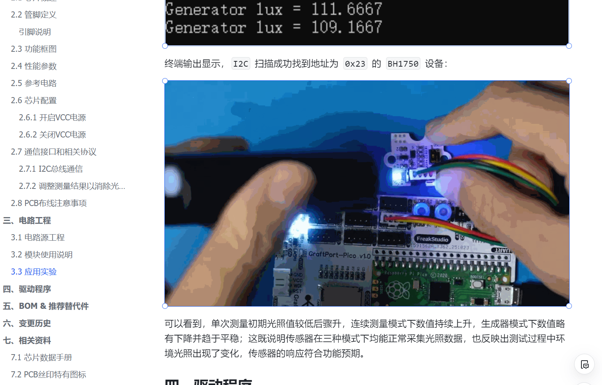

**部分模块汇总如下，持续更新中：**


## 3.3 快速原型扩展板与教学案例库

在完成核心知识点的系统学习后，我们为你无缝衔接了适合快速原型制作的专属扩展板 GraftPort 与配套教学案例库，帮你从 “知识点掌握” 直接跨越到 “练手小项目的原型落地”。**真正把学习成果转化为可见的实战作品，形成 “学习 → 实践 → 原型 → 迭代” 的完整能力闭环。**

相关链接：[基于 GraftPort 扩展板的教学案例（开放版）](https://f1829ryac0m.feishu.cn/wiki/Ctg2wSiRHiMbVokRjryct6AMnue?from=from_copylink)

**部分教学案例汇总如下，持续更新中：**

| 案例名称                     | 能学到的核心知识点                                                                                                                                                                                                                                                                            |
| ---------------------------- | --------------------------------------------------------------------------------------------------------------------------------------------------------------------------------------------------------------------------------------------------------------------------------------------- |
| 无接触式呼吸心跳测量装置     | 1. 硬件连接：学会用 UART、I2C 接口连接雷达、OLED 屏，按键接 GPIO 口（下拉模式防误触）；2. 数据处理：读取雷达数据，提取呼吸、心跳数值（入门级数据解析）；3. 交互操作：OLED 屏分两行显示数据，实现按键短按触发测量、长按停止的逻辑；4. 实用技巧：知道锂电池低电量会影响数据，学会规避常见故障。 |
| 心率血氧健康监测仪           | 1. 传感器使用：连接 MAX30102 模块，学会采集心率、血氧基础数据；2. 显示控制：用 4 位数码管切换显示心率、血氧，长按锁定数值；3. 异常判断：设置正常范围（心率 40-180、血氧 ≥90%），超出则 LED 闪烁报警；4. 实操要点：知道传感器要贴紧指尖，避免漏光影响数据。                                   |
| 水质 TDS 检测装置            | 1. 模拟信号采集：用 ADC 接口读取 TDS 传感器数据，换算成 ppm 值；2. 显示与报警：OLED 显示 TDS 值和水质等级，超标时蜂鸣器报警、LED 闪烁；3. 校准技巧：学会用蒸馏水校准传感器（让数据更准）；4. 注意事项：知道水温对测量的影响，了解探头清洁维护方法。                                           |
| 红外测温人体感应报警装置     | 1. 多传感器协同：连接红外测温（MLX90614）和人体感应（L916）模块，实现“有人才测温”；2. 温度报警：设置 36.5℃ 阈值，超标时蜂鸣器间歇报警，OLED 显示温度；3. 功耗优化：待机时低频率检测人体，避免浪费电量；4. 安装技巧：知道测温距离和传感器防误触发的方法（避阳光、加透镜）。                 |
| 土壤温湿度与光照综合监测站   | 1. 多总线使用：学会单总线（DS18B20 测温度）、双 I2C 总线（光照、OLED）的基础连接；2. 数据转换：把土壤湿度 ADC 值改成百分比，光照值换算成勒克斯（lx）；3. 显示设计：OLED 循环显示 3 个参数，固定标题让界面更清晰；4. 避坑要点：避免两个 I2C 设备地址冲突，传感器分开安装防干扰。               |
| 触摸按键控制风扇调速装置     | 1. PWM 调速：用 PWM 信号控制风扇转速，设置 3 档转速（低/中/高/关）；2. 触摸交互：用触摸按键切换档位，数码管显示当前档位（0-3）；3. 硬件适配：知道风扇最低转速不能太低（≥20%），否则启动不了；4. 灵敏度调节：学会调整触摸按键灵敏度，防止误触发。                                             |
| 北斗导航定位数据采集装置     | 1. 串口通信：连接北斗模块，读取定位数据（经纬度、海拔）；2. 数据转换：把经纬度改成“度分秒”格式，方便看懂；3. 状态反馈：用 LED 提示定位成功/失败，失败时提醒移到开阔处；4. 基础校验：知道波特率要设 9600，避免数据错误导致程序卡壳。                                                         |
| 震动与红外感应防盗报警装置   | 1. 触发检测：用震动、人体感应模块检测异常，布防后触发报警；2. 状态切换：按键切换布防撤防，OLED 显示当前状态；3. 报警控制：报警时蜂鸣器响、LED 闪，长按按键复位；4. 防误触：固定震动传感器，给人体感应模块加透镜缩小检测范围。                                                                 |
| 表面肌电信号强度监测装置     | 1. 生物信号采集：用 ADC 接口读取肌电信号，基础滤波去除干扰；2. 强度显示：把信号转换成百分比，OLED 显示状态（正常/异常）；3. 峰值与报警：按键锁定峰值，信号超出范围（＜10% 或 ＞80%）时报警；4. 抗干扰：知道用屏蔽线连接，电极片要贴紧皮肤、涂导电膏。                                         |
| 便携式心电信号采集装置       | 1. 心电采集：连接心电模块，读取心电信号并过滤干扰；2. 蓝牙传输：用 BLE 蓝牙把数据发去手机 APP，实现实时查看；3. 功耗控制：无手机连接时降低采样率，节省电量；                                                                                                                                  |
| 烟雾浓度实时监测报警装置     | 1. 气体检测：连接烟雾模块，读取浓度数据，等待 30 秒预热（数据才稳定）；2. 报警逻辑：浓度 ≥500ppm 时蜂鸣器间歇报警，OLED 显示状态；3. 安装规范：模块要装在通风处，避免气体积聚导致数据不准；4. 数据滤波：简单处理数据，去除异常波动，让显示更稳定。                                           |
| 智能护眼台灯                 | 1. 自动调光：用光照传感器采集亮度，自动调节台灯亮度（目标 300lx）；2. 手动控制：触摸按键开关台灯，长按无极调光（10%-100%）；3. 护眼技巧：PWM 频率设 1kHz 以上，避免灯光频闪伤眼；4. 防误触：触摸按键远离金属表面，接线做好绝缘。                                                              |
| 多肉植物 UV 紫外灯补光控制器 | 1. 灯控调节：用 MOS 管控制 UV 灯，PWM 无极调节亮度（0-100%）；2. 计时保护：UV 灯最长开 8 小时，超时自动关闭，防止灼伤植物；3. 手动操作：旋转电位器调亮度，按键开关灯（带 10ms 消抖防误触）；4. 安全要点：UV 灯远离人体，设备放干燥处，避免浇水短路。                                          |
| 噪音检测仪                   | 1. 音频采集：用麦克风模块读取声音强度，换算成 dB 值（相对值）；2. 超标提醒：噪音 ＞85dB 时 LED 闪烁，OLED 提示“噪音超标”；3. 数据导出：用蓝牙把一天的噪音数据导出，方便查看；4. 校准说明：知道 dB 值是参考值，需专业设备校准才精准。                                                        |

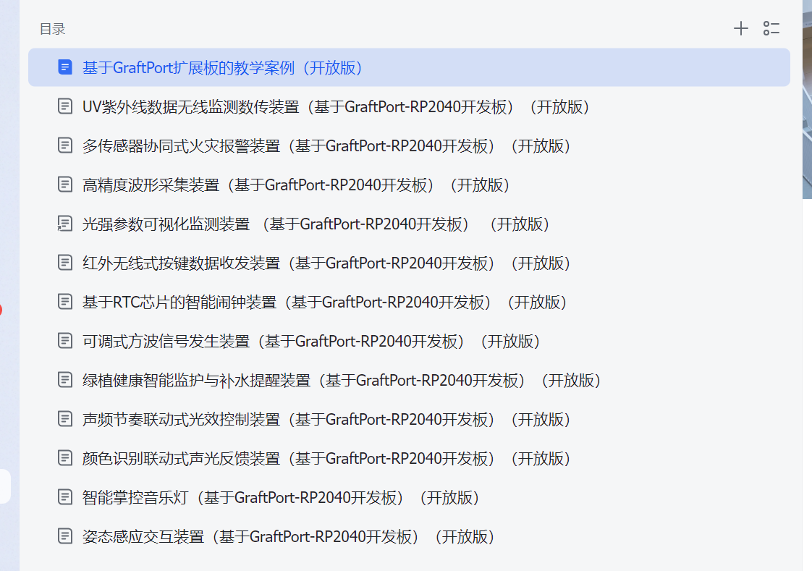

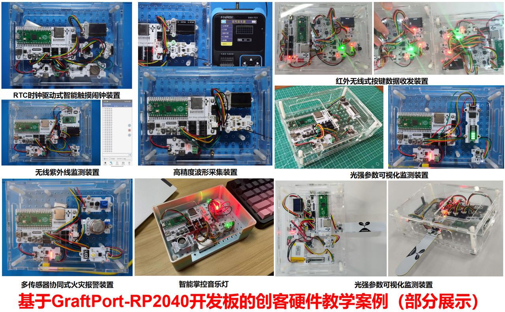

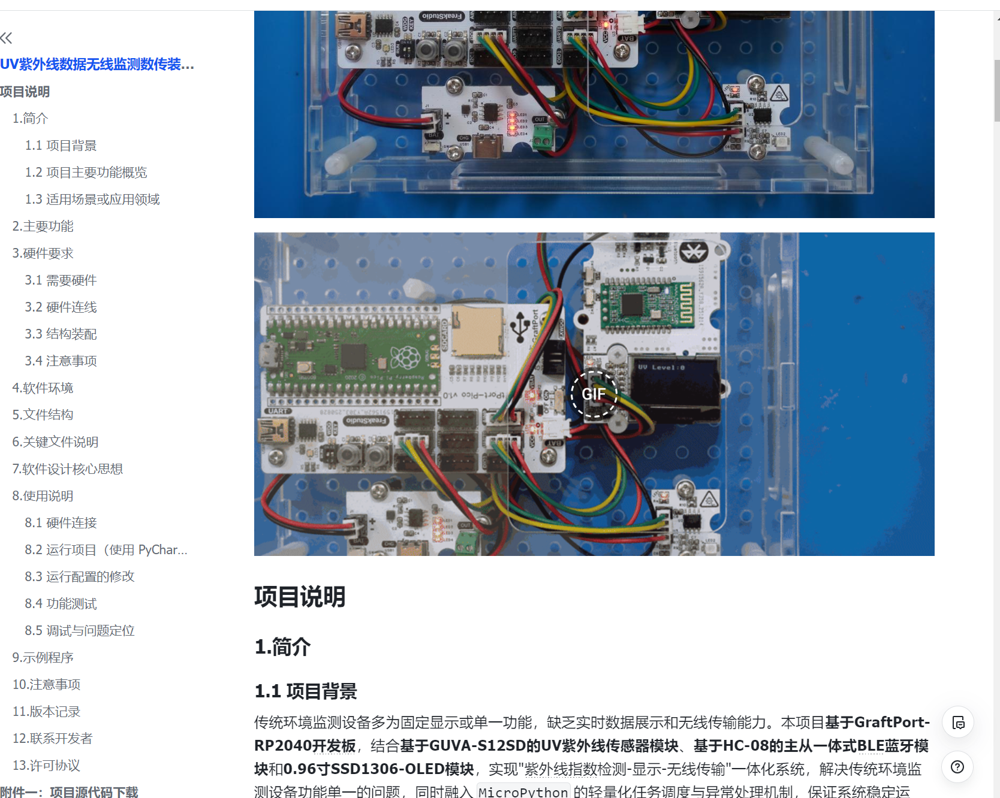

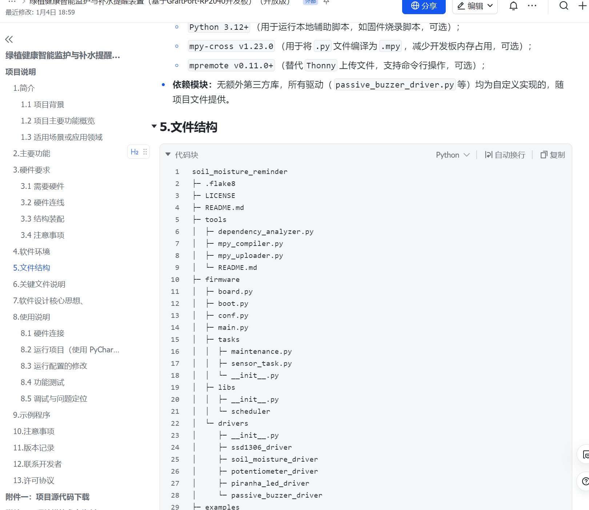

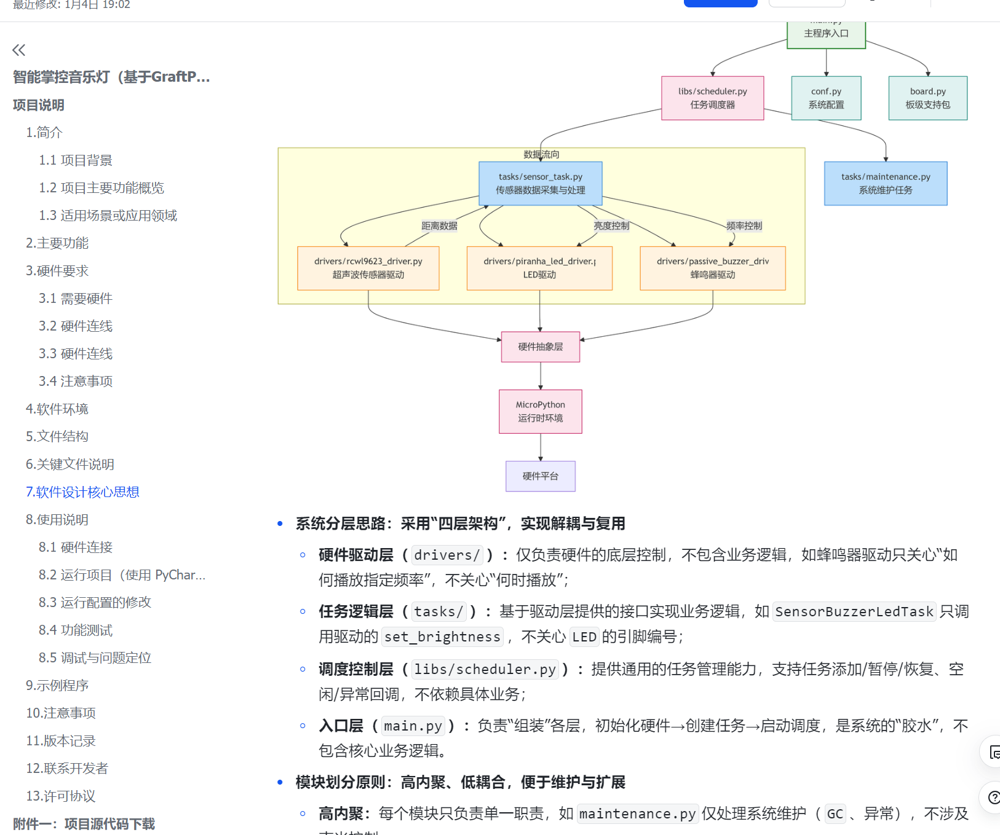

## 3.4 Python 编程进阶教程

我们配套了《全网最适合入门的面向对象编程教程》与《一文速通 Python 并行计算》两份特色教程，区别于网上零散、偏重理论或单一场景的教程，这两份教程从 “原理拆解 → 代码实践 → 项目落地” 形成完整闭环：

- 面向对象教程结合嵌入式传感器项目案例深化理解；
- 并行计算教程聚焦嵌入式场景下的并发性能优化


不仅帮你建立可复用的知识体系，更能直接支撑硬件项目的二次开发需求。

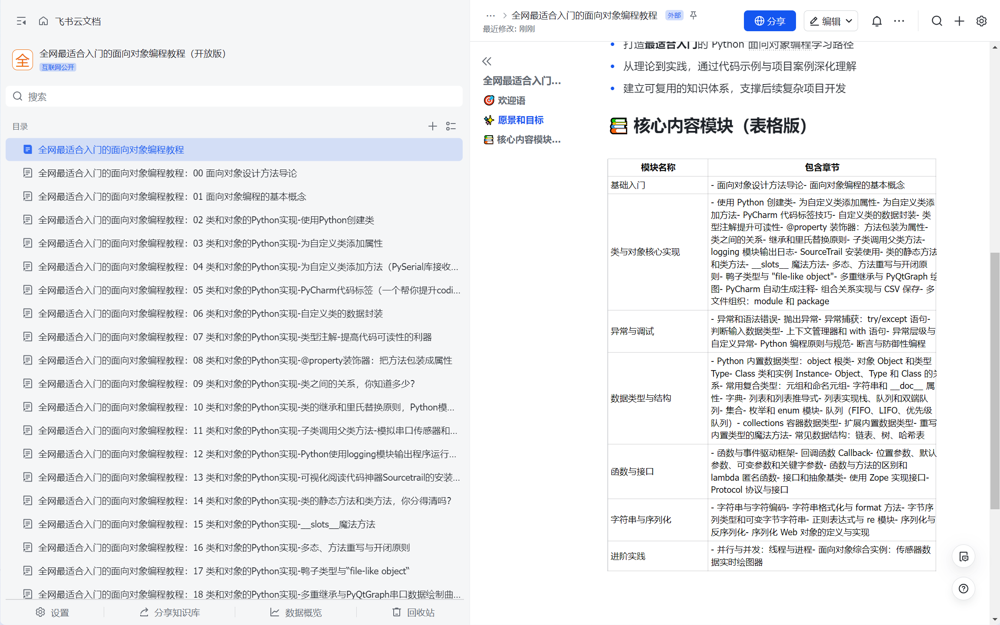

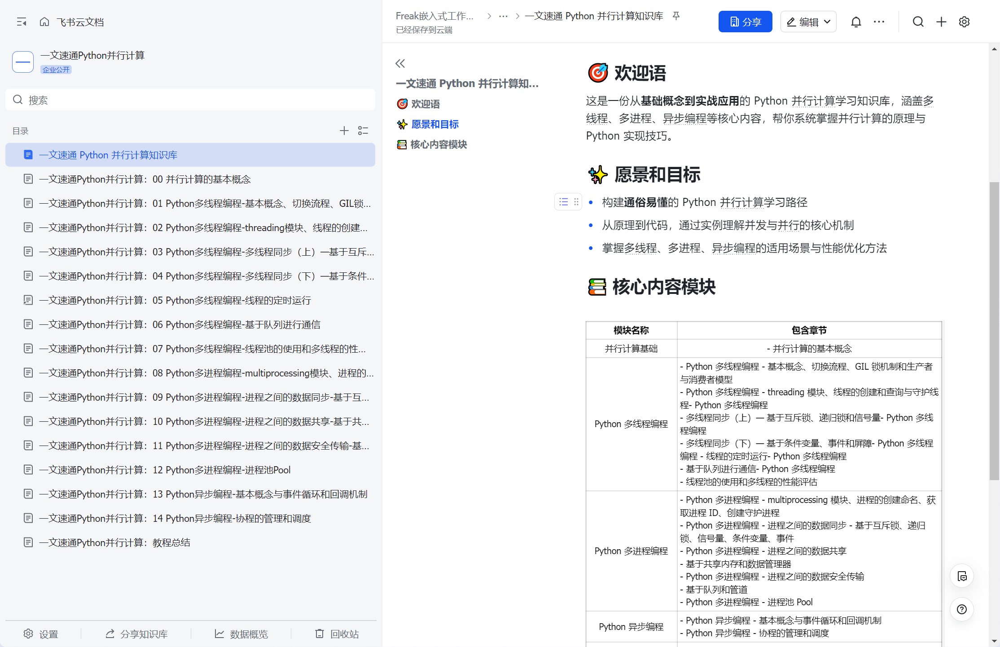

- **面向对象编程：**[https://f1829ryac0m.feishu.cn/wiki/space/7596544900980591570?ccm_open_type=lark_wiki_spaceLink&open_tab_from=wiki_home](https://f1829ryac0m.feishu.cn/wiki/space/7596544900980591570?ccm_open_type=lark_wiki_spaceLink&open_tab_from=wiki_home)
- **一文速通 Python 并行计算：**[https://f1829ryac0m.feishu.cn/wiki/space/7596547761378429917?ccm_open_type=lark_wiki_spaceLink&open_tab_from=wiki_home](https://f1829ryac0m.feishu.cn/wiki/space/7596547761378429917?ccm_open_type=lark_wiki_spaceLink&open_tab_from=wiki_home)

## 3.5 案例和硬件全开源

### 3.5.1 代码全开源

- **面向对象设计：**所有驱动 / 案例代码均采用工业级面向对象（OOP）范式开发，严格遵循 SOLID 设计原则，类结构清晰、接口标准化，不仅贴合实际使用，更便于你理解 “模块化、分层设计” 的核心思想，从入门就养成专业的代码思维。
- **标准化注释体系：**代码配套标准化注释，覆盖文件说明、类 / 方法功能、参数 / 返回值解释、异常提示等全维度，关键逻辑、边界条件标注清晰，零基础也能快速看懂代码逻辑，无需反复查资料，学习效率翻倍。
- **全开源可追溯：**所有代码 100% 开源，附带编码规范文档，注释格式、命名规则、设计思路全公开，既能直接套用做项目，也能通过开源代码反向学习一些嵌入式编码技巧。

仓库地址：[https://github.com/leezisheng/elegance-devkit-v1_DemoCode](https://github.com/leezisheng/elegance-devkit-v1_DemoCode)

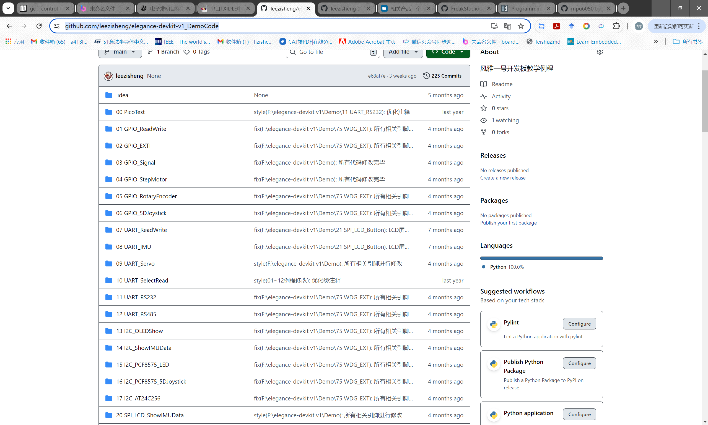

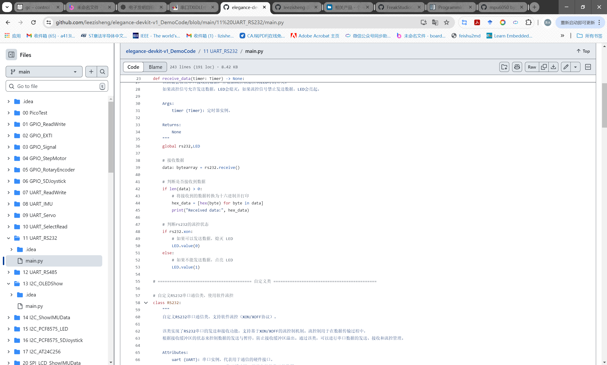

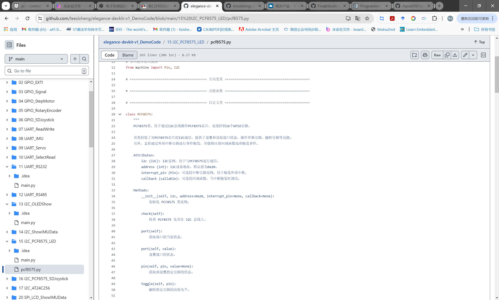

### 3.5.2 开发板硬件全开源

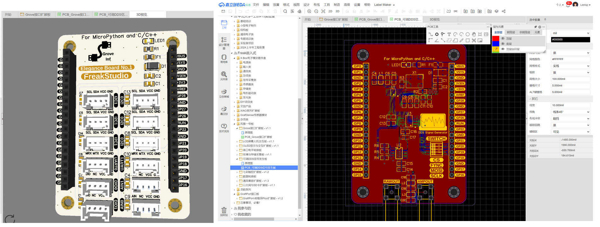

风雅一号板全系列硬件设计 100% 开源，并已完整上架**立创开源广场**，你可直接获取全套可编辑的硬件设计文件（原理图、PCB 版图、BOM 物料清单、焊接指南）：

- **开源平台可追溯**：所有硬件设计文件在立创开源广场公开，可直接下载复刻、修改优化；
- **手工焊接友好型设计**：核心优化封装选型，板上大部分电阻、电容均采用 **0805 通用封装**（而非微型 0402/0603），引脚间距大、易识别，新手也能轻松手工焊接，无需专业贴装设备，降低硬件复刻、维修、DIY 改造的门槛；

## 3.6 专属 uPyPI 平台

类似 PyPI 的包管理，一键安装驱动库，支持第三方库发布：

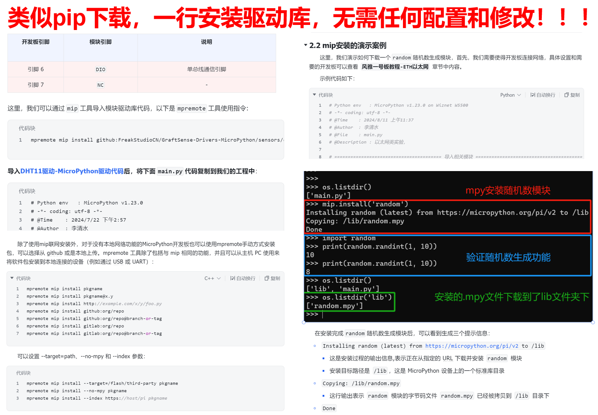

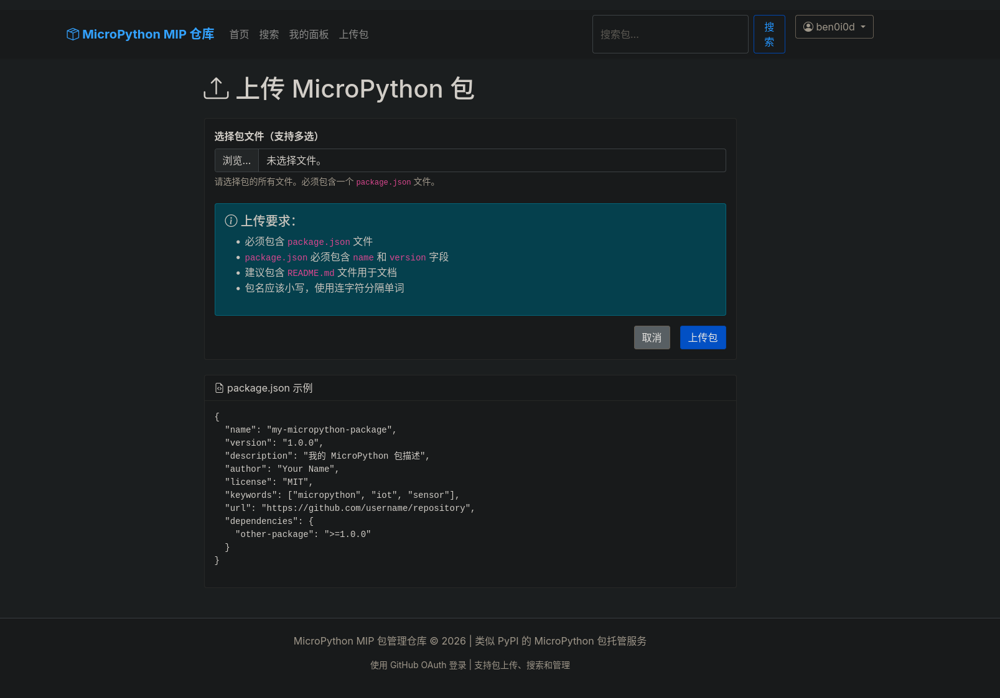

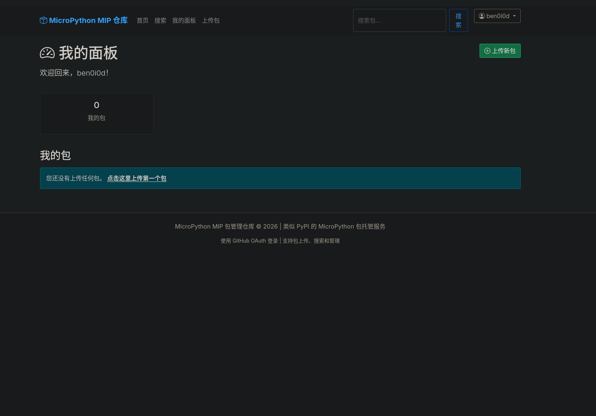

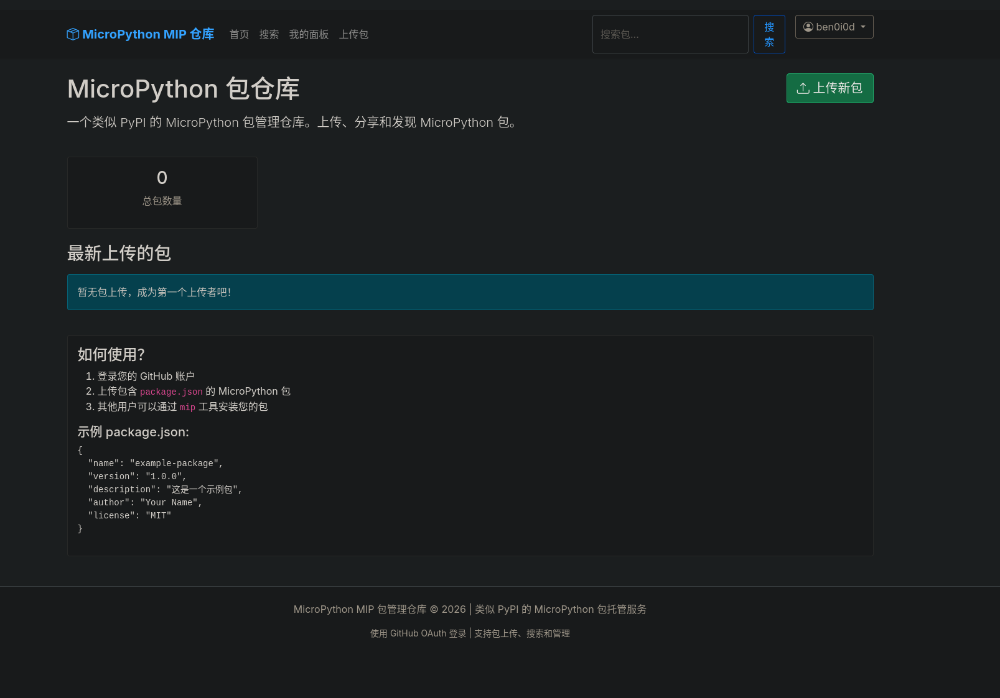

## 3.x 基于 Bipes 的 MicroPython 图形化教程-中小学/零基础 DIY

作为适合快速原型制作的专属扩展板 GraftPort 的**独家配套内容（风雅一号板核心课程不包含此模块）**，我们特别推出了这套轻量化的图形化编程教程，Bipes 通过拖拽式积木块替代传统代码编写，无需记忆 MicroPython 语法，就能完成硬件控制、数据采集、逻辑判断等核心功能：

- 尤其适合零基础爱好者、青少年学习者快速入门，或是开发者在原型验证阶段快速迭代想法；
- 搭配 GraftPort 扩展板的即插即用硬件模块，你可以在图形化界面中直接调用传感器、OLED 屏幕、通信模块等资源，拖拽积木即可生成可执行的 MicroPython 代码，实时在扩展板上运行验证，大幅降低从 “想法” 到 “可运行原型” 的门槛。

教程涵盖从基础图形化指令到复杂原型项目的全流程，包括传感器数据可视化、互动装置搭建、物联网节点开发等案例，不仅能帮你快速验证硬件方案，还能通过图形化与代码的对应展示，自然过渡到纯代码开发，为后续深入学习 MicroPython 打下扎实基础。

**部分教程汇总如下，持续更新中：**[中小学生图形化编程教程知识库](https://f1829ryac0m.feishu.cn/wiki/OwpzwQ8lUigBrMkv2nvcgm2fnje?from=from_copylink)


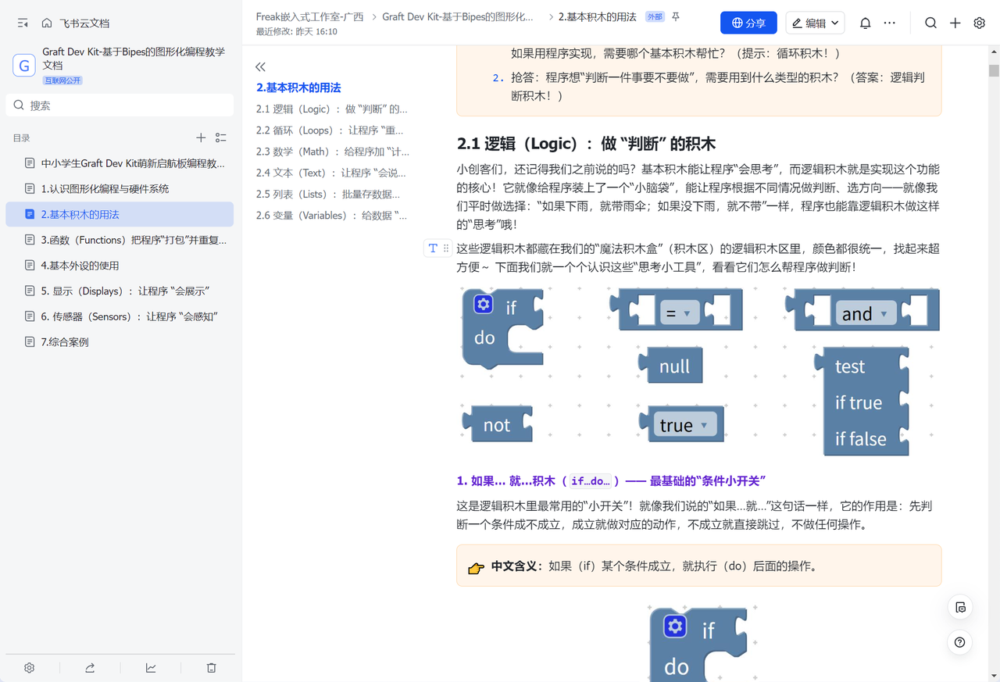


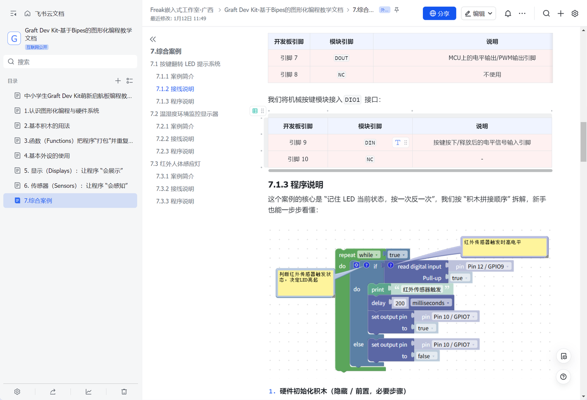

# 四、售后服务有什么？

- **🤝 售后 Q 群 + 作者亲答：学习问题不卡壳**

  - 售后交流 QQ 群有产品 / 教程作者亲自解答核心问题：不管是代码调试卡壳、硬件焊接出错，还是项目落地遇到的难点，都能得到精准、接地气的解决方案，让学习路上没人掉队。
- **📚 持续更新的学习资源：一次购买，终身受益**

  - 公众号专栏：定期分享 MicroPython 实战技巧、嵌入式进阶玩法、用户优秀项目案例；
  - 动态更新 Wiki 文档：硬件使用指南、代码案例、驱动库说明等核心资料会随用户反馈、技术升级实时更新，始终保持内容的时效性和实用性，不用担心学不到最新玩法。
- **🛡️ 安心的硬件保障：购物无风险，学习更放心**

  - 我们承诺硬件售后不打折扣，让你买得安心、用得省心：
  - 7 天无理由退货：收到开发板后，若未拆封、无物理损坏，支持 7 天无理由退货，无需担心 “买错、不适用”；
  - 15 天换新服务：收货 15 天内，若出现非人为损坏的硬件故障，可直接申请换新，省去维修等待的时间成本，不耽误学习进度；
  - 终身技术支持：硬件使用过程中遇到的焊接、调试、适配问题，作者会全程提供指导，不是 “卖完就不管”，而是陪你把开发板用透、用会。

# 五、相关网络地址和代码开源仓库

**仓库地址：**[https://github.com/orgs/FreakStudioCN/repositories](https://github.com/orgs/FreakStudioCN/repositories)

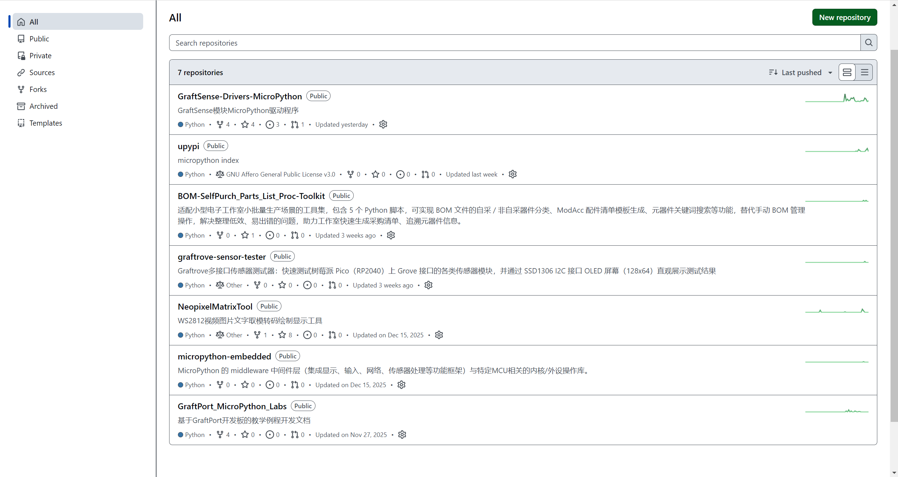

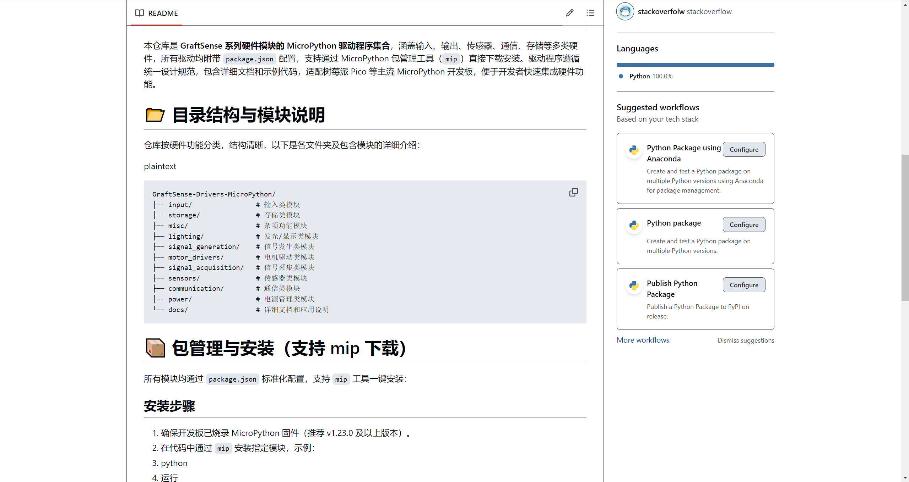

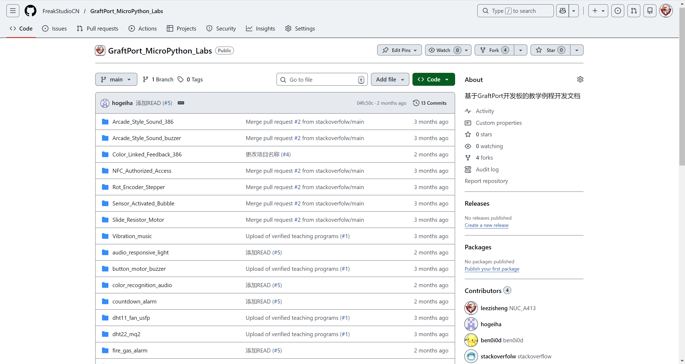

**wiki 地址：****[https://freakstudio.cn/](https://freakstudio.cn/)**

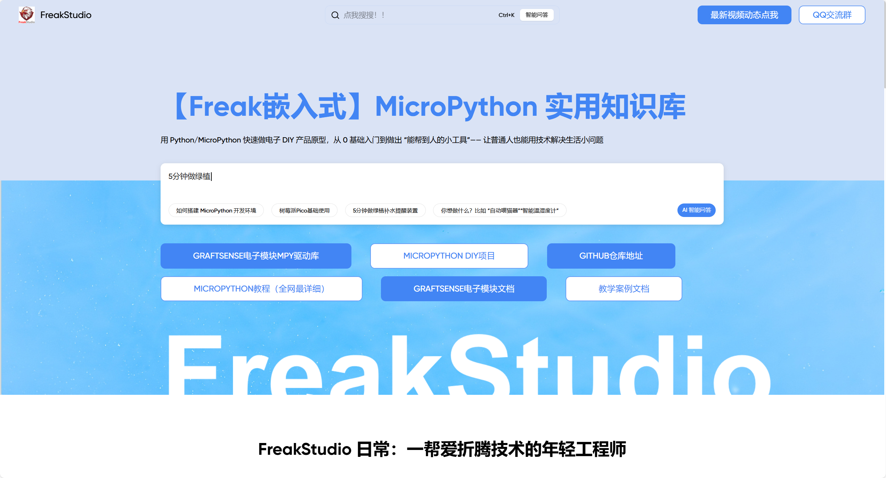

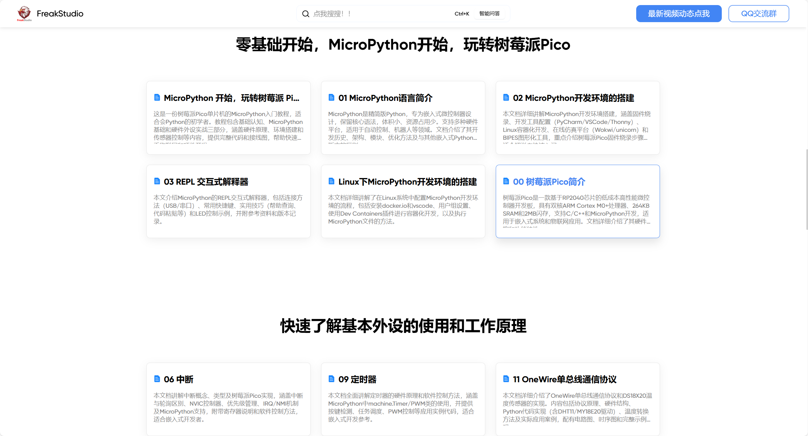

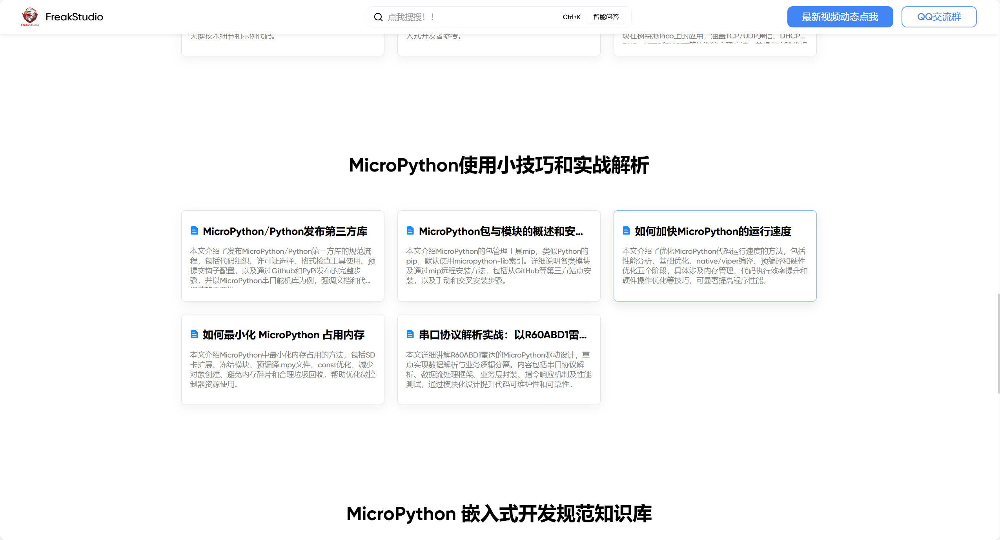

**uPyPi 地址：****[https://upypi.net/](https://upypi.net/)**

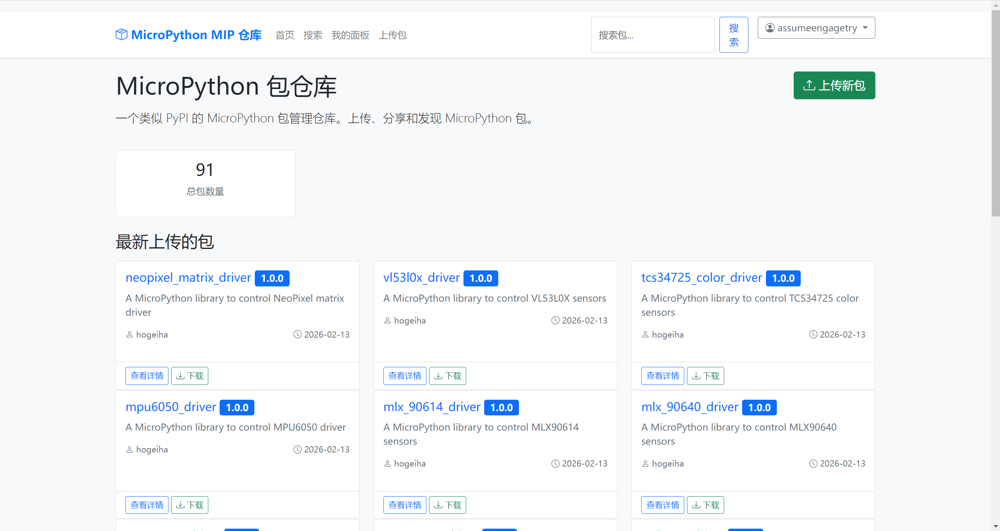

**图形化编程软件地址：****[https://freakstudiocn.github.io/pages/ui/](https://freakstudiocn.github.io/pages/ui/)**

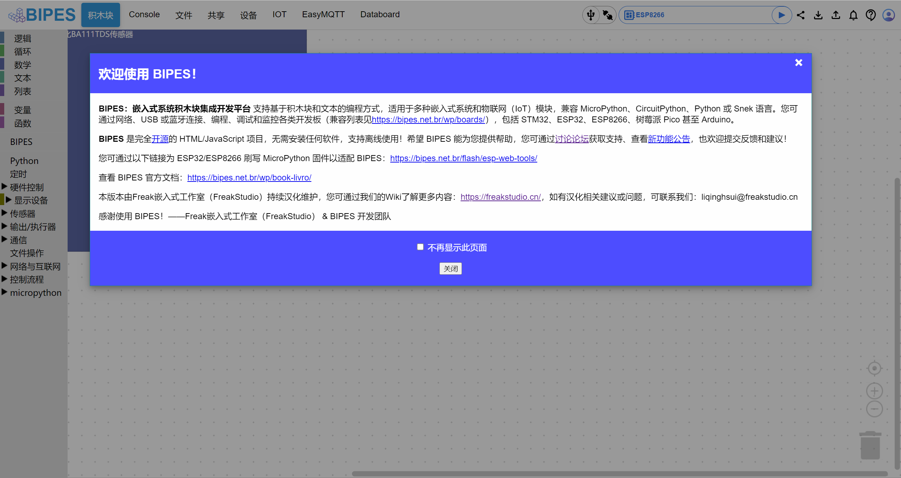

# 参考资料

无。

# 知识库版本记录

| **版本号** | **修改人员** | **时间**   | **内容**                                   |
| ---------- | ------------ | ---------- | ------------------------------------------ |
| v1.0       | 李子圣       | 2025/12/27 | 初始化知识库                               |
| v1.1       | 李子圣       | 2025/01/23 | 添加了第四节：知识点汇总。                 |
| v1.2       | 李子圣       | 2025/01/24 | 增加了 uMial 的使用。                      |
| v1.2.1     | 李子圣       | 2025/01/25 | 增加了发货清单表格，需增加步进电机驱动板。 |
| v1.3.0     | 李子圣       | 2026/02/15 | 更改了相关网页。                           |
